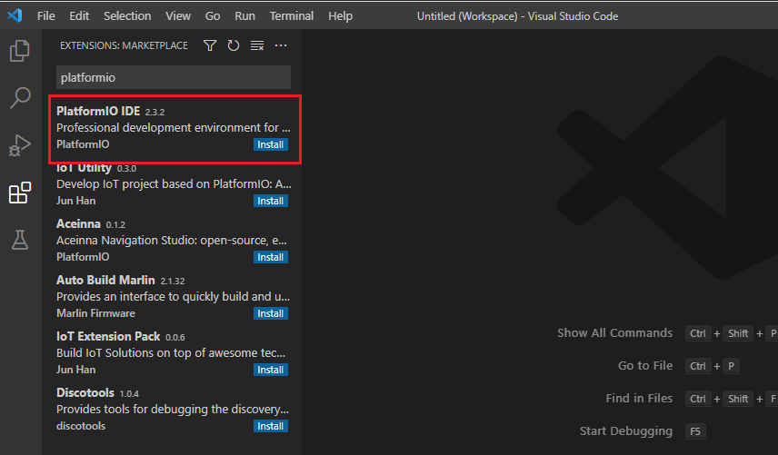
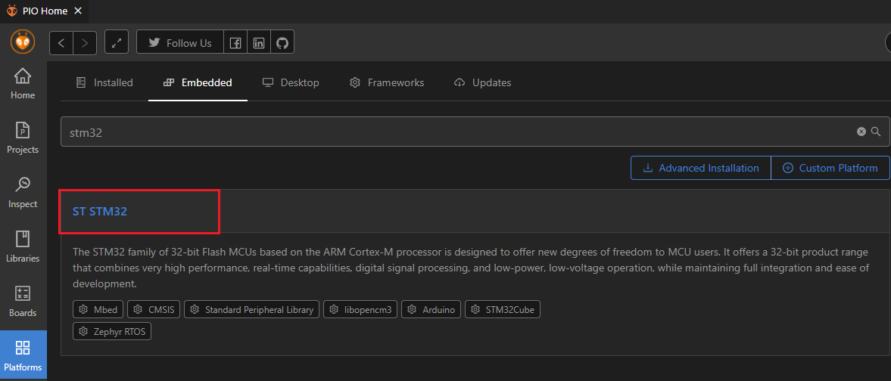
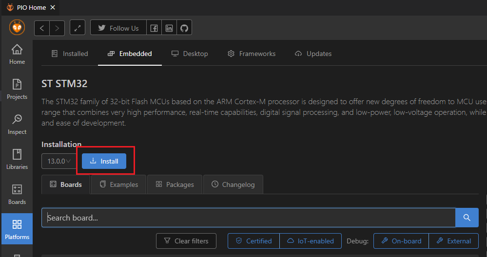
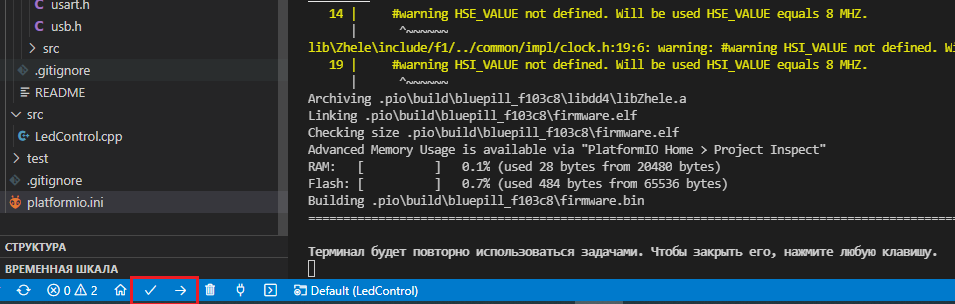
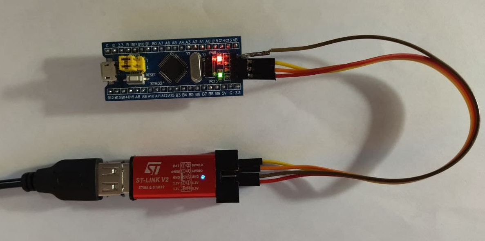

# Урок 0. Настройка рабочего пространства. Зажигаем светодиод.

## Вступление
Начинаю цикл (надеюсь, что это действительно будет цикл) небольших уроков, посвященных
программированию микроконтроллеров Stm32 с применением разрабатываемой мною библиотеки (или фреймворка) **Zhele**.

Я не являюсь профессиональным разработчиком в принципе, со электроникой тоже знаком лишь поверхностно.
В связи с этим фактом прошу меня извинить за
возможные неточности в вопросах, связанных именно с электроникой (например, я абсолютно не различаю определения "передний фронт" и "восходящий фронт", хотя, судя по прочитанным сообщениям на форумах,
это как минимум не одно и то же, а как максимум только один вариант в принципе корректен).
Также мой текущий уровнь, к сожалению, не позволяет добавить в материалы теоретическую часть, благо
в сети достаточно хороших источников. Из всего, что мне попадалось на русском языке, наибольшим образом
мне помогли м понравились статьи на ресурсе hubstub.ru. Материал изложен подробно, понятно, и, что самое главное,
есть примеры кода на чистом CMSIS.

## О фреймворке
Микроконтроллерами начал заниматься исключительно в качестве хобби, никаиких реальных проектов и даже задач
у меня не было и нет (даже полив цветов мне не нужен ввиду их отсутствия), поэтому мне хотелось
и было важно не просто получить какой-то работающий девайс (иначе взял бы Arduino), а научиться
писать качественный, красивый и оптимальный (в свои студенческие годы я любил повторять фразу
"память-то бесплатная", когда не хотел оптимизировать решения, теперь же понял, что много где
до сих пор нужно экономить) код. Попробовл поуправлять светодиодом на CMSIS, SPL, HAL, LL, однако не самые
лестные отзывы об этих решениях не давали покоя. Однажды наткнулся на статью
[Работа с портами ввода-вывода микроконтроллеров на Си++](http://easyelectronics.ru/rabota-s-portami-vvoda-vyvoda-mikrokontrollerov-na-si.html), предлагаемый автором подход понравился
и я стал пытаться пользоваться его [фреймворком mcucpp](https://github.com/KonstantinChizhov/Mcucpp),
построенным полностью на шаблонах C++.

Проект покрывает семейства AVR, ARM, MSP430, содержит в себе много классов для управления периферией,
контейнеры, файловую систему, драйверы и многое другое, объем поражает. Но для меня, как новичка,
было крайне сложно всё это запустить, так как документации практически нет, примеров нет, а "из коробки"
многое не работает. Поэтому я решил продолжить изучение микроконтроллеров путем постепенного
приведения в порядок разработок Константина Чижова (автора статьи и проекта mcucpp, если вдруг кто-то
решил не переходить по ссылкам), а именно добавлять Doxy-документацию, проверять работоспособность
кода, добавлять примеры. Делать это в виде форка было тяжело, поэтому родился новый проект
[Zhele](https://github.com/azhel12/Zhele), гораздо менее амбициозный, предназначен только для Stm32,
не содержит пока много чего из оригинального проекта, однако не содержит мелких ошибок, покрыт
документацией и тестами, а также движется в направлении универсальности для различных контроллеров
Stm32.

Кто-то может сказать, что я просто своровал чужие наработки, и с натяжкой это будет правдой. В то же
время никакой выгоды я с этого не имею, а автором исходников, взятых из mcucpp, указан именно
оригинальный автор, то есть Константин Чижов. Надеюсь, что ни он, ни другие люди не будут иметь ничего
против того, что я делаю.

# Среда разработки
Для разработки я использую связку Visual Studio Code + расширение PlatformIO. Далее пошагово
приведен процесс установки и создания заготовки проекта.
1. Скачать Visual Studio Code с [официального сайта](https://code.visualstudio.com/download) и установить.
2. Запустить VSCode, нажать *Ctr+Shift+X* (или нажать на *Расширения* (*Extensions*) в панели слева),
ввести строку *PlatformIO* в окно поиска и нажать кнопку *Install*.
Могут возникнуть ошибки, связанные с невозможностью создания виртуального окружения Python, решение
проблемы несложно найти в интернете.

3. Открыть *PIO Home*, нажать на *Platforms*, выбрать *Emedded*, ввести *stm32* и нажать на заголовок *ST STM32*.

4. Нажать *Install* и дождаться окончания установки.

5. Открыть *PIO Home* *Home*, нажать *New Project*, ввести название проекта, целевой контроллер (плату) (в примерах будет использован популярная плата **Blue Pill** на stm32f103) и выбрать **CMSIS** в списке _Framework_.

6. Скопировать директорию **Zhele/Zhele** из репозитория в директорию **lib** проекта.

7. В директорию **src** скопировать любой пример или создать новый **.cpp** файл. Например, файл **LedControl.cpp**

8. Отредактировать файл **platformio.ini** для целевого устройства. Дополнительно к автоматически сгенерированному содержимому необходимо указать способ загрузки и отладки прошивки, а также добавить несколько флагов компилятора (а именно указать используемый стандарт языка C++, в нашем случае это **c++17**, хотя в дальнейшем при использовании USB будет использован **c++20**, и определить идентификатор **STM32F1**). В моем случае файл содержит следующее:
```[env:bluepill_f103c8]
platform = ststm32
board = bluepill_f103c8
framework = cmsis
debug_tool = stlink
upload_port = stlink
build_flags = 
    -D STM32F1
    -std=c++17
build_unflags =
    -std=c++11
```
9. Скомпилировать проект, загрузить его на контроллер.


10. Наблюдать результат :)


# Первая программа. GPIO. Управляем светодиодом.
Библиотека **Zhele** предоставляет два основных семейства классов для работы с портами и линиями ввода-вывода:
1. **Port*X***, где ***X*** - буквенное обозначение порта. То есть в зависимости от целевого контроллера для пользователя доступны классы **Porta**, **Portb** и так далее. Данные классы позволяют управлять портом ввода вывода:
    1. Включать и отключать тактирование.
    2. Читать и записывать значения.
    3. Задавать настройки порта (конфигурацию, режим, подтяжку, скорость).

2. **P*X*_Y_**, где ***X*** - буквенное обозначение порта, ***Y*** - номер линии. Опять же в зависимости от выбранного контроллера пользователю доступны различные класса, например, **Pa1**, **Pa2** и так далее. Данные классы содержат аналогичный набор методов, только применяются они для конкретной линии.

> Также для каждого класса линии ввода-вывода есть соответствующий ему класс с суффиксом Inv, который представляет собой инвертированную версию. Это актуально для платы Blue Pill, на линии C13 которого расположен светодиод, однако для его включений необходимо подать на соответствующий пин логический 0.

Подробную документацию можно получить из Doxy-комментариев в исходных кодах библиотеки (из-за особенностей строения библиотеки эти комментарии расположены в файлах директории Zhele/include/common), либо в скомпилированной Doxy-документации PDF (однако из-за того, что библиотека полностью построена на шаблонах C++, количество классов очень большое, пользоваться документацией, к сожалению, не очень удобно).


Ниже предложен исходный код программы, которая конфигурирует пин **C13**, на котором на плате **Blue Pill** расположен светодиод.

1. Задание "переменной" линии C13. Для используемой библиотеки некорректно определение "экземпляр класса", поскольку создание экземпляра заменяется инстанцированием шаблонного класса. В связи с этим объявление переменных представляет собой задание alias-а для класса:
```c++
using Led = Pc13Inv;
```
2. Включение тактирование порта:
```c++
Led::Port::Enable();
```

3. Задание конфигурации (Out):
```c++
Led::SetConfiguration(Led::Configuration::Out);
```

4. Задание режима (PushPull):
```c++
Led::SetDriverType(Led::DriverType::PushPull);
```

5. Задание скорость (Slow): *Необязательно в нашей задаче
```c++
Led::SetSpeed(Led::Speed::Slow);
```

6. Непосредственно включение светодиода:
```c++
Led::Set();
```


Вообще говоря первый пункт не является обязательным, а в 2-5 можно вместо `Led` писать `Pc13`, однако хорошим тоном будет сделать так, как показано в примере. В этом случае, если понадобится перенести светодиод на другой пин, достаточно будет изменить только строку `using Led = Pc13Inv;` на другую (например, `using Led = Pa4;`)

Получившийся исходный код целиком:
```c++
#include <iopins.h>

using Led = Zhele::IO::Pc13Inv;

int main()
{
    // Включение тактирования порта
    Led::Port::Enable();
    // Конфигурация - выход
    Led::SetConfiguration(Led::Configuration::Out);
    // Режим -  Push-pull
    Led::SetDriverType(Led::DriverType::PushPull);
    // Скорость - низкая
    Led::SetSpeed(Led::Speed::Slow);
    // Запись 1 (на самом деле 0, так как класс инвертированный)
    Led::Set();

    for(;;)
    {
    }
}
```

Без обяъвления alias-ов код бы выглядел так:
```c++
#include <iopins.h>

int main()
{
    // Включение тактирования порта
    Zhele::IO::Pc13::Port::Enable();
    // Конфигурация - выход
    Zhele::IO::Pc13::SetConfiguration(Zhele::IO::Pc13::Configuration::Out);
    // Режим -  Push-pull
    Zhele::IO::Pc13::SetDriverType(Zhele::IO::Pc13::DriverType::PushPull);
    // Скорость - низкая
    Zhele::IO::Pc13::SetSpeed(Zhele::IO::Pc13::Speed::Slow);
    // Запись 0
    Zhele::IO::Pc13::Clear();

    for(;;)
    {
    }
}
``` 