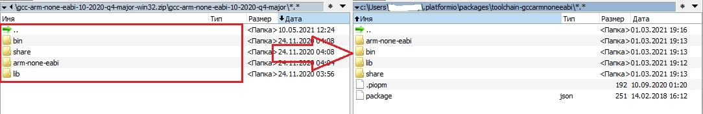

[//]: <> (Stm32. Переходим на современный C++. Часть 1. Настройка рабочего пространства.)

# Вступление

В сети появляется всё больше материалов, посвященных применению языка C++ для программирования микроконтроллеров.
Являясь сторонником этого направления, хочу поделиться теми знаниями и умениями, которые получил,
в виде цикла статей-уроков с рассмотрением вопросов разработки для Stm32 на современном языке C++ 
с применением разрабатываемой мною библиотеки (или фреймворка) **Zhele**.

Я не являюсь профессиональным разработчиком в принципе, со электроникой тоже знаком лишь поверхностно. В связи с этим фактом прошу меня извинить за возможные неточности в вопросах, связанных именно с электроникой (например, я абсолютно не различаю определения "передний фронт" и "восходящий фронт", хотя, судя по прочитанным сообщениям на форумах, это как минимум не одно и то же, а как максимум только один вариант в принципе корректен). К сожалению, мои текущие знания не позволяют добавить в материалы качественную теоретическую часть,
благо в сети достаточно хороших источников. Из всего, что мне попадалось на русском языке, наибольшим образом мне помогли и понравились статьи на таких ресурсах как **microtechincs.ru, hubstub.ru, istarik.ru, microsin.net**. Материал изложен подробно, понятно, и, что самое главное, есть примеры кода на чистом CMSIS.

# О фреймворке

Микроконтроллерами начал заниматься исключительно в качестве хобби, никаких реальных проектов и даже задач
у меня не было и нет (даже полив цветов мне не нужен ввиду их отсутствия), поэтому мне хотелось
и было важно не просто получить какой-то работающий девайс (иначе взял бы Arduino), а научиться
писать качественный, красивый и оптимальный код. Попробовал поуправлять светодиодом на CMSIS, SPL, HAL, LL, однако не самые
лестные отзывы об этих решениях не давали покоя. Однажды наткнулся на статью
[Работа с портами ввода-вывода микроконтроллеров на Си++](http://easyelectronics.ru/rabota-s-portami-vvoda-vyvoda-mikrokontrollerov-na-si.html), предлагаемый автором подход понравился и я стал пытаться пользоваться его [фреймворком mcucpp](https://github.com/KonstantinChizhov/Mcucpp),
построенным полностью на шаблонах C++.

Проект покрывает семейства AVR, ARM, MSP430, содержит в себе много классов для управления периферией,
контейнеры, файловую систему, драйверы и многое другое, объем поражает. Но для меня, как новичка,
было крайне сложно всё это запустить, так как документации практически нет, примеров нет, а "из коробки"
многое не работает. Поэтому я решил продолжить изучение микроконтроллеров путем постепенного
приведения в порядок разработок Константина Чижова (автора статьи и проекта mcucpp, если вдруг кто-то
решил не переходить по ссылкам), а именно добавлять Doxy-документацию, проверять работоспособность
кода, добавлять примеры. Делать это в виде форка было тяжело, поэтому родился новый проект
[Zhele](https://github.com/azhel12/Zhele), гораздо менее амбициозный, предназначен только для Stm32,
не содержит пока много чего из оригинального проекта, однако не содержит мелких ошибок, покрыт
документацией и тестами, а также движется в направлении универсальности для различных контроллеров
Stm32.

# Среда разработки
Много копий сломано в спорах о лучшей IDE, компиляторе, я же считаю, что лучшим решением является то, которое удобно конкретному программисту.
Для разработки я использую связку **Visual Studio Code** + расширение **PlatformIO**. Далее пошагово приведен процесс установки и создания заготовки проекта:
1. Скачать Visual Studio Code с [официального сайта](https://code.visualstudio.com/download) и установить.
2. Запустить VSCode, нажать *Ctr+Shift+X* (или нажать на *Расширения* (*Extensions*) в панели слева),
ввести строку *PlatformIO* в окно поиска и нажать кнопку *Install*.
Могут возникнуть ошибки, связанные с невозможностью создания виртуального окружения Python, решение
проблемы несложно найти в интернете.

3. Открыть *PIO Home*, нажать на *Platforms*, выбрать *Emedded*, ввести *stm32* и нажать на заголовок *ST STM32*.

4. Нажать *Install* и дождаться окончания установки.

5. Открыть *PIO Home* *Home*, нажать *New Project*, ввести название проекта, целевой контроллер (плату) (в примерах будет использован популярная плата **Blue Pill** на stm32f103) и выбрать **CMSIS** в списке _Framework_.

6. Так как предполагается использовать возможности современных стандартов C++, в том числе C++20, нужно вручную обновить
компилятор. Для этого необходимо загрузить "Arm Embedded Toolchain" c [официального сайта](https://developer.arm.com/downloads/-/gnu-rm).
На сайте выбрать gcc-arm-none-eabi-10.3-2021.10-win32.zip.

7. Распаковать скачанный архив и скопировать с заменой директории bin, share, arm-none-eabi и lib в _C:\\Users\\%Username%\\.platformio\\packages\\toolchain-gccarmnoneeabi\\_ (В некоторых версиях Platofrmio эта директория может иметь другое имя: _toolchain-gccarmnoneeabi@VERSION_). **Внимание!** Не удаляйте файлы .piopm и package.json.

8. Скопировать директорию **Zhele/Zhele** из репозитория в директорию **lib** проекта.

9. В директорию **src** скопировать любой пример или создать новый **.cpp** файл. Например, файл **LedControl.cpp**

10. Отредактировать файл **platformio.ini** для целевого устройства. Дополнительно к автоматически сгенерированному содержимому необходимо указать способ загрузки и отладки прошивки, а также добавить несколько флагов компилятора (а именно указать используемый стандарт языка C++, в нашем случае это **c++20** и определить идентификатор **STM32F1**). В моем случае файл содержит следующее:
```[env:bluepill_f103c8]
platform = ststm32
board = bluepill_f103c8
framework = cmsis
debug_tool = stlink
upload_port = stlink
build_flags = 
    -D STM32F1
    -std=c++20
build_unflags =
    -std=c++11
```
11. Скомпилировать проект, загрузить его на контроллер.


Если проект не собрался, а VSCode отобразил поле ввода в верхней части экрана, перезапустите VS Code и повторите попытку.

Архив с проектом можно загрузить с [Яндекс.Диска](https://disk.yandex.ru/d/HdWQr3IaCvPcPw).
Статья в формате PDF доступна также на [Яндекс.Диске](https://disk.yandex.ru/i/1DYKrUpbLqGJqg).

На следующем занятии подробно рассмотрим возможности библиотеки в части управления портами ввода-вывода.