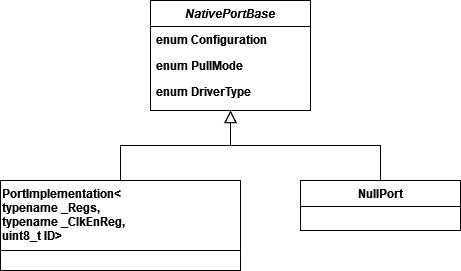

[//]: <> (Stm32. Переходим на современный C++. Часть 2. Работа с портами ввода-вывода.)

# Вступление
На прошлом занятии мы развернули рабочее пространство, а также собрали первый проект из готового исходника.
Сейчас предлагается рассмотреть возможности по управлению портами и линиями ввода-вывода, предоставляемые библиотекой.
Все классы для работы с GPIO доступны в заголовочных файлах **<ioport.h>** и **<iopins.h>**

# Интерфейс GPIO
Библиотека **Zhele** предоставляет два основных семейства классов для работы с портами и линиями ввода-вывода:
1. **Port*X***, где ***X*** - буквенное обозначение порта. То есть в зависимости от целевого контроллера для программиста доступны классы **Porta**, **Portb** и так далее.
Данные классы позволяют управлять портом ввода вывода:
    1. Включать и отключать тактирование порта.
    2. Читать и записывать значения.
    3. Задавать настройки порта (конфигурацию, режим, подтяжку, скорость) для конкретных линий (по маске).

2. **P*X*_Y_**, где ***X*** - буквенное обозначение порта, ***Y*** - номер линии. Опять же в зависимости от выбранного контроллера пользователю доступны различные класса, например, **Pa1**, **Pa2** и так далее. Данные классы содержат аналогичный набор методов, только применяются они для конкретной линии.

> Также для каждого класса линии ввода-вывода есть соответствующий ему класс с суффиксом **Inv**, который представляет собой инвертированную версию. Это актуально, например, для платы Blue Pill, на линии C13 которого расположен светодиод, однако для его включений необходимо подать на соответствующий пин логический 0.

## Классы и методы **ioports**

Заголовочный файл **ioports** предоставляет следующую иерархию классов:


Базовый класс `NativePortBase` содержит перечисления для более строгого контроля
типов (в этом, кстати, заключется одно из преимуществ C++ - строгий контроль за типами):
```
/// Конфигурация порта
enum Configuration
{
    Analog = 0,	///< Аналоговый режим
    In = 0x04,	///< Вход
    Out = 0x03, ///< Выход
    AltFunc = 0x0B ///< Альтернативная функция
};
```
```
// Режим порта
enum DriverType
{
    PushPull = 0,	///< push-pull
    OpenDrain = 4	///< open-drain
};
```
```
/// Подтяжка
enum PullMode
{
    NoPull = 0,	///< Без подтяжки
    PullUp = 0x08,	///< Подтяжка к "+" (pull-up)
    PullDown = 0x18	///< Подтяжка к "-" (pull-down)
};
```
```
/// Скорость
enum Speed
{
    Slow = 2, ///< Медленная (< 2 MHz)
    Medium = 1, ///< Средняя (< 10 MHz)
    Fast = 3 ///< Быстрая (< 50MHz)
};
```

Базовый класс в свою очередь расширяют два:
1. `NullPort` - класс-заглушка, все операции которого не производят реальных действий.
2. Шаблон `PortImplementation` - шаблон класса для конкретного порта ввода вывода,
   имеет три шаблонных параметра:
   1. `_Regs` - обертка над регистрами порта (структурой `GPIO_TypeDef`).
   2. `_ClkEnReg` - обертка над регистром включения тактирования (об этом более подробно на следующих занятиях).
   3. `ID` - буква порта, по сути, не используется, так что пояснения можно опустить.

Шаблон класса `PortImplementation` инстанцирован значениями, соответствующими реальным портам контроллера, например:
`using Porta = PortImplementation<GPIOA, Zhele::Clock::PortaClock, 'A'>;`, а программисту, соответственно, доступен новый **тип** `Porta` со своими статическими методами.

`PortImplementation` имеет интерфейс, представленный следующими статическими методами:
1. `DataType Read()` - возвращает текущее значение регистра `ODR`.
2. `void Write(DataType value)` - записыват значение в регистр `ODR`.
3. `void ClearAndSet(DataType clearMask, DataType setMask)` - очищает и устанавливает линии, соответствующие маскам (через регистр `BSRR`).
4. `void Set(DataType value)` - устанавливает значение линии по заданной маске (через регистр `BSRR`).
5. `void Clear(DataType value)` - сбрасывает линии по заданной маске (через регистр `BSRR`).
6. `void Toggle(DataType value)` - инвертирует выводе по заданной маске.
7. `DataType PinRead()` - читает порт в режиме входа.
8. `void SetConfiguration(DataType mask, Configuration configuration)` - устанавливает конфигурацию линий по заданной маске.
9. `void SetSpeed(DataType mask, Speed speed)` - устанавливает скорость линий по заданной маске.
10. `void SetDriverType(DataType mask, DriverType driver)` - устанавливает режим выхода по заданной маске.
11. `void SetPullMode(DataType mask, PullMode mode)` - устанавливает подтяжку по заданной маске.
12. `void AltFuncNumber(DataType mask, uint8_t number)` - устанавливает номер альтернативной функции по заданной маске (недоступно для контроллеров Stm32F1, поскольку у них модуль AFIO работает иначе).
13. `void Enable()` - включает тактирование порта.
14. `void Disable()` - выключает тактирование порта.

Для всех методов с параметрами библиотека предоставляет их шаблонный вариант, позволяющий сэкономить Flash-память за счет оптимизации, рекомендуется использовать именно шаблонный вариант, если настройки известны на этапе компиляции. Например, задать конфигурацию порта можно так: `Porta::SetConfiguration(0xffff, Porta::Configuration::Out)`, а можно более оптимально: `Porta::SetConfiguration<0xffff, Porta::Configuration::Out>()`.

## Пример управления портом A
Решим элементарную задачу - настроить линии 0, 1, 3 порта `A` на выход (push-pull) и установить
на них высокий уровень.
```
Porta::Enable();
Porta::SetConfiguration<0b1011, Porta::Configuration::Out>();
Porta::SetDriverType<0b1011, Porta::DriverType::PushPull>();
Porta::Set(0b1011);
```
Полный проект этого примера доступен на [Яндекс.Диске](https://disk.yandex.ru/d/hxZbOAtNNsaUBA)

Прошивка занимает 0 байтов RAM и 64 байтов Flash (вместе со стандартным startup получается 28 и 380 соответственно).

Запуск прошивки в Proteus демонстрирует, что программа работает правильно (высокий уровень на выходых `PA0, PA1, PA3`).


## Классы и методы **iopins**

Гораздо чаще на практике приходится взаимодействовать с отдельными линиями ввода-вывода. Для этих целей библиотека предоставляет набор классов, инстанцирующих шаблон класса `TPin`, содержащий те же самые методы, что и рассмотренный ранее класс, реализующий порт ввода-вывода. Очевидно, что методы конфигурации и настройки одельной линии лишены первого параметра - маски. Решим ту же задачу используя три независимых типа: `Pa0, Pa1, Pa3`:

```
Pa0::Port::Enable();
Pa0::SetConfiguration<Pa0::Configuration::Out>();
Pa0::SetDriverType<Pa0::DriverType::PushPull>();
Pa0::Set();

Pa1::Port::Enable(); // Это лишнее, порт итак тактируется
Pa1::SetConfiguration<Pa1::Configuration::Out>();
Pa1::SetDriverType<Pa1::DriverType::PushPull>();
Pa1::Set();

Pa3::Port::Enable(); // Это лишнее, порт итак тактируется
Pa3::SetConfiguration<Pa3::Configuration::Out>();
Pa3::SetDriverType<Pa3::DriverType::PushPull>();
Pa3::Set();
```

Полный проект этого примера доступен на [Яндекс.Диске](https://disk.yandex.ru/d/xfNFBQctr-dY6Q).

Прошивка занимает уже 0 байтов RAM и 144 байтов Flash (вместе со стандартным startup получается 28 и 380 соответственно).

В Proteus мы получим ту же самую картинку.

Можно заметить, что было бы крайне удобно иметь возможность скомпоновать собственный виртуальный порт из заданных линий и управлять им как целым. Такая возможность в библиотеке есть и будет рассмотрена на следующем занятии.

Статья в формате PDF доступна также на [Яндекс.Диске](https://disk.yandex.ru/i/3TAQwsdrt0RuQA).