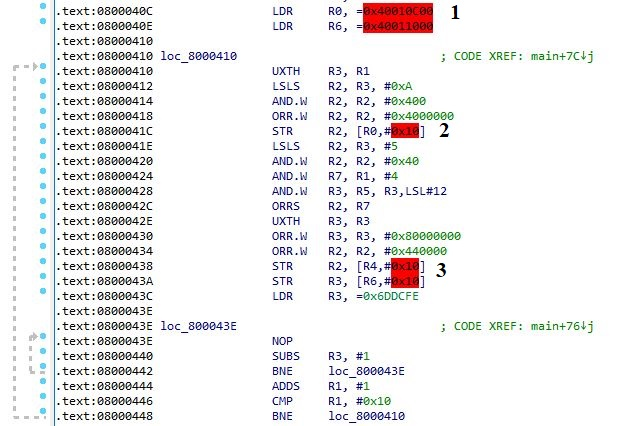

[//]: <> (Stm32. Переходим на современный C++. Часть 3. Виртуальные порты ввода-вывода.)

# Вступление
На прошлом занятии мы рассмотрели управление портами и отдельными линиями ввода-вывода и подытожили тем фактом, что на практике было бы удобно иметь
возможность "собрать" порт из отдельных линий, необязательно идущих подряд, необязательно одного физического порта. Такая возможность требуется
в целях упрощения разработки печатной платы, а также в случае активного использования периферии, когда те или иные линии портов заняты.

# Применение шаблонов C++ для создания виртуальных портов
Представим, что мы хотим объединить линии PA0, PB4, PA3, PB2 в один четырехбитный порт.
Сразу же напрашивается вполне очевидное объявление шаблона класса, в котором конкретные линии являются шаблонными аргументами:
```c++
template<typename... _Pins>
class VirtualPort{};
```

Использование этого класса (объявление нового виртуального порта) представляет собой инстанцирование шаблона (что в некотором смысле является
аналогом создания объекта обычного класса):

```c++
using ExampleVirtualPort = VirtualPort<Pa0, Pb4, Pa3, Pb2>;
```

Теперь попробуем предложить возможную реализацию методов этого шаблона (в перспективе интерфейс класса должен в точности совпадать
с интерфейсом класса обычного порта, который мы рассматривали на прошлом занятии).

Рассмотрим метод включения тактирования порта: `void Enable()`. Несложно догадаться, что для корректной реализации достаточно выполнения двух действий:
1. Определить, какие физические порты участвуют в качестве части виртуального.
2. Включить тактирование всех физических портов.

Самая примитивная, но неоптимальная реализация этого метода может выглядеть так:
```c++
static void Enable()
{
    (_Pins::Port::Enable(), ...);
}
```
На этапе компиляции для предложенного нами примера данная свертка `(_Pins::Port::Enable(), ...)` преобразуется в последовательный вызов четырех методов:
```c++
Pa0::Port::Enable(); // Включение тактирования порта A;
Pb4::Port::Enable(); // Включение тактирования порта B;
Pa3::Port::Enable(); // Включение тактирования порта A (повторно!);
Pb2::Port::Enable(); // Включение тактирования порта B (повторно!);
```
Недостатком является то, что в такой реализации для одного и того же физического порта тактирование будет включаться столько раз, сколько линий этого порта участвуют в составном виртуальном. Однако, как правило, данный метод вызывается единожды, поэтому этот факт можно проигнорировать. В библиотеке эта проблема решена, однако рассмотрение решения выходит за рамки этой статьи (интересующиеся могут посмотреть в исходниках). Если вкратце, то для любого списка типов существует возможность исключить дублирование, то есть получить элементы без повтора, и уже к ним применить вызов метода.

Теперь рассмотрим любой метод управления портом, потому что их реализация похожа: в целом нет разницы между настройкой конфигурации, режима виртуального порта или записи в него числового значения. Остановимся на методе установки битов. Прототип метода возьмем из класса обычного порта: `void Set(DataT value);`

К сожалению, очевидного решения, как в случае с методом включения тактирования, здесь не существует, поскольку параметр метода (значение для записи)
шаблонным не является (это было бы странным), соответственно задачу невозможно разрешить шаблонными методами в compile-time.

Решим несколько вспомогательных задач.

### Определение принадлежности линий виртуального порта физическому
В первую очередь хочется научиться определять, какие именно линии 
виртуального порта принадлежат тому или иному физическому. Это можно
сделать во время компиляции, что позволяет задействовать шаблонную магию.

В составе библиотеки представлен заголовочный файл **type_list.h**, содержащий
определение **списка типов** а также инструменты для работы с такими списками.
Данная тема не относится напрямую к разработке программ для микроконтроллеров, поэтому предлагаю вынести реализацию этих инструментов за рамки статьи, ограничившись описанием некоторых из них. Однако, если будет запрос на углубленное объяснение действия шаблонов C++, в частности понятия списка типов, я подготовлю отдельный материал на эту тему.

Само понятие списка типов очень простое (стоит отметить, что простым оно стало
со стандарта C++17, а до этого использовалось рекурсивное определение, которое предложил Андрей Александреску в книге "Современное проектирование на С++" и реализации своих идей в виде библиотеки **LOKI**):

```c++
template<typename... Types>
class TypeList{};

// Использование
using MyTypeList = TypeList<int, int, double, std::vector>;
// Применительно к нашему случаю
using MyPins = TypeList<Pa0, Pb4, Pa3, Pb2>;
```

Внимательный читатель скажет, что это то же самое, что `std::tuple` и будет 
абсолютно прав!

Сам по себе список типов никакой пользы не несет, пока мы не определили возможные операции над ним. К базовым можно отнести следующие:
- Взятие типа по его индексу;
- Определение индекса типа в списке;
- Определение принадлежности типа списку типов.

Для общего понимания работы со списками типа разберем первую операцию из представленных: взятие типа по его индексу.
Как правило, для работы со списками типов применяется рекурсивный подход, потому что для самого понятия списка можно
предложить рекурсивное определение: **список - это первый элемент и хвост, который в свою очередь тоже является списком**.

```c++
// Базовый класс для дальнейшей специализации
// Первый шаблонный параметр - номер типа
// Второй (variadic) - список типов
template<int, typename...>
class GetType {};

// Специализация дна рекурсии, когда из списка <Head, Tail>
// нужно извлечь начальный (нулевой) тип.
template<typename Head, typename... Tail>
class GetType<0, TypeList<Head, Tail...>>
{
public:
    using type = Head;
};

// Общий случай: если Index > 0, то берем тип с номером
// Index - 1 из хвоста списка
template<int Index, typename Head, typename... Tail>
class GetType<Index, TypeList<Head , Tail...>>
{
    static_assert(Index < Length<TypeList<Head, Tail...>>::value);
public:
    using type = typename GetType<Index - 1, TypeList<Tail...>>::type;
};
```

Но есть и более продвинутые задачи, например:
- Удаление дубликатов из списка;
- Сортировка по предикату;
- Поиск (фильтрация) типов по предикату.

Последний пункт нам подходит! Допустим, что для произвольного списка типов
доступен следующий функционал:
```c++
template<template <typename> class Predicate, typename... Types>
class Sample<Predicate, TypeList<Types...>>
{
public:
    // type - это список типов, удовлетворяющих предикату Predicate
    using type = ...;/
};
```

Тогда мы может определить такой предикат:
```c++
// Шаблон класса с единственным шаблонным параметром - целевой порт
template<typename _ExpectedPort>
class IsSamePort
{
public:
    // Сам предикат, проверяющий совпадение порта линии с заданным
    template<typename _Pin>
    class type : public std::is_same<_ExpectedPort, typename _Pin::Port>
    {
    };
};
```
Используя утилиту `Sample`, мы можем объявить следующее:
```c++
template<typename _Port, typename _PinList>
using PinsForPort = typename Sample<IsSamePort<_Port>::template type, _PinList>::type;
```
Здесь тип `PinsForPort` и будет являться списком типов линий ввода-вывода, относящихся к порту `_Port`.

### Извлечение из значения виртуального порта значений физических портов
Итак, мы научились для данного списка линий определять, какие именно из них
принадлежат заданному физическому порту. Теперь необходимо иметь возможность
сгенерировать значение регистра `BSRR` конкретного физического порта на основе
переданного в функцию `Set` значения. Например, в нашем примере
при вызове метода `Set` виртуального порта с аргументом `0xf` должен
быть вызван метод `Set` порта `Pa` с аргументом `0x9` (установлены биты с номерами 3 и 0).

Рассмотрим следующий шаблон функции (для упрощения примем, что
и виртуальный порт, и все физические шестнадцатибитные):
```c++
template<typename... _PortPins>
template<typename _PinList>
uint16_t PinListExpander<TypeList<_PortPins...>>::ExpandPinlistValue(uint16_t value)
{
    return (((value & (1 << TypeIndex<_PortPins, _PinList>::value)) > 0 ? 1 << _PortPins::Number : 0) | ...);
}
```
здесь
- `<typename... _PortPins>` - линии физического порта в составе виртуального (получены на прошлом шаге)
- `<typename... _PortPins>` - полный список линий виртуального порта.

Теперь последовательно рассмотрим смысл выражения, раскрывая скобки:
- `1 << TypeIndex<_PortPins, _PinList>::value` - получение индекса линии в составе виртуального порта. В нашем примере для `Pa0` это выражение примет значение 0, для `Pa3` - значение 2;
- `(value & (1 << TypeIndex<_PortPins, _PinList>::value) > 0 ?` - определение, установлена или нет линия виртуального порта для заданного аргумента метода. В нашем примере для аргумента `0xf` получим `1` для `Pa0` и `Pa3`;
- `1 << _PortPins::Number` - отображение единичного бита виртуального порта в единичный бит физического. То есть значение `0b1111` нашего виртуального порта будет преобразовано в значение `0b1001` физического порта **A**;
- `((value & (1 << TypeIndex<_PortPins, _PinList>::value)) > 0 ? 1 << _PortPins::Number : 0) | ...` - раскрытие сверточного выражения с бинарным оператором *ИЛИ*, что позволяет "собрать" значение из отдельных битов.

Приблизительно таким же образом можно реализовать и другие методы класса виртуального порта.

# Виртуальные порты в Zhele
В моей библиотеке реализация виртуальных портов (хотя по сути это практически на 100% код Константина Чижова) представлена заголовочным файлом `pinlist.h`, предоставляющий пользователю шаблон класса `PinList`. Нет смысла рассматривать интерфейс этого класса, поскольку он совпадает с интерфейсом рассмотренного ранее класса `Port`, поэтому сразу рассмотрим пример, демонстрирующий возможности класса.

Обозначим примитивную задачу управления четырями светодиодами как единым портом. Будем считать, что
печатная плата разработана таким образом, что светодиоды расположены на линиях **Pa0, Pa1, Pb1, Pc15**.

Объявить виртуальный порт можно следующим образом:
```c++
#include <iopins.h>
#include <pinlist.h>

using namespace Zhele::IO;

using LedPort = PinList<Pa0, Pa1, Pb1, Pc15>;
```

Собственно, на этом сложность и заканчивается! С типом `LedPort` можно работать как с обычным портом.

Чтобы включить тактирование виртуального порта, необходимо вызвать метод `Enable`:
```c++
LedPort::Enable();
```
Реализация этого метода вызовет метод `Enable` для каждого реального используемого порта. Поскольку
определение используемых портов ввода-вывода осуществляется еще на этапе компиляции, причем в этом
списке уничтожаются дубликаты, то в Runtime для каждого реального порта ввода-вывода метод влючения
тактирования будет вызван единожды. Достичь такого при помощи макросов **невозможно**.

Чтобы сконфигурировать порт для задачи управления светодиодами,
необходимо задать конфигурацию (Out) режим (PushPull), скорость (Slow, хотя необязательно):
```c++
LedPort::SetConfiguration<LedPort::Configuration::Out>();
LedPort::SetDriverType<LedPort::DriverType::PushPull>();
LedPort::SetSpeed<LedPort::Speed::Slow>();
```

Запись значений в порт приведет к установлению на линиях **Pa0, Pa1, Pb1, Pc15** логических 0 и 1
в соответствии со значением. Например, чтобы зажечь нулевой и второй светодиоды
(то есть установить логическую 1 на линии **Pa0, Pb1**), необходимо записать в порт число `0b101 = 5`:
```c++
LedPort::Write(0b101);
```

Осталось лишь скомпилировать программу, залить прошивку на контроллер и убедиться, что все работает
именно так, как задумано.

На этом описание виртуальных портов подошло к концу. Как можно заметить, нет абсолютно ничего сложного.
Код получается понятный, поддерживаемый и достаточно оптимальный (если будет необходимость, то готов
дизассмблировать прошивку и продемонстрировать результаты).

Если когда-то возникнет необходимость перекоммутировать виртуальный порт на другие линии, то для
этого достаточно будет незначительно изменить только объявление типа `LedPort`.

Полный код программы ниже:
```c++
#include <delay.h>
#include <iopins.h>
#include <pinlist.h>

using namespace Zhele::IO;

using LedPort = PinList<Pb10, Pa6, Pa2, Pc15>;

int main()
{
    // Включение тактирования виртуального порта.
    LedPort::Enable();

    // Конфигурирование порта
    LedPort::SetConfiguration<LedPort::Configuration::Out>();
    LedPort::SetDriverType<LedPort::DriverType::PushPull>();
    LedPort::SetSpeed<LedPort::Speed::Slow>();

    // 4 диода = 16 комбинаций 
    for(int i = 0; i < 16; ++i)
    {
        // Запись значения в порт
        LedPort::Write(i);
        // Пауза
        Zhele::delay_ms<1000>();
    }

    for(;;)
    {
    }
}
```

В цикле счетчик увеличивается от 0 до 15 (0b0000...0b1111),
то есть 4 светодиода с задержкой в 1 секунду отобразят все возможные комбинации.


Поскольку определение физических портов произошло во время компиляции, программа достаточно хорошо оптимизируется.
Рассмотрим дизассемблированную прошивку, а именно первый цикл:


здесь
1. Смещения до регистров портов **A** и **B** (см таблицу 3 из Reference Manual).
2. Загрузка значения в регистр BSRR порта **A** (BSRR имеет смещение 0x10).
3. Загрузка значений в регистры BSRR портов **B** и **C** .

Полный проект этого примера доступен на [Яндекс.Диске](https://disk.yandex.ru/d/tfF31aZ3L71lpg).

Статья в формате PDF доступна также на [Яндекс.Диске](https://disk.yandex.ru/i/Y12_C4M-7bfovQ).

На этом мы заканчиваем рассмотрение библиотеки в части касающейся **GPIO** (хотя, конечно, в будущем будут рассмотрены вопросы назначения альтернативных функций)
и переходим к более интересным материалам. Далее переходим к рассмотрению таймеров, а начнем на следующем занятии с рассмотрения базовых таймеров в Stm32.

