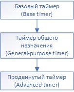

[//]: <> (Stm32. Переходим на современный C++. Часть 4. Таймеры. Базовый таймер.)

# Вступление
На прошлом занятии мы закончили рассмотрение способами управления портами ввода-вывода с применением
полностью шаблонной библиотеки [Zhele](https://github.com/azhel12/Zhele). На сегодняшнем занятии начем
рассматривать такую обширную тему, как таймеры, и начем, конечно, с базовых их возможностей, реализованных
в базовых таймерах.

# Таймеры в контроллерах Stm32
Все таймеры, представленные в микроконтроллерах Stm32 можно разделить на три категории, причем
состоявляющих иерархию, где каждый тип расширяет возможности предыдущего, как показано на рисунке.



Рассмотрим возможности базовых таймеров и соответствующий интерфейс библиотеки.

# Базовый таймер
Компания ST в условиях широкого ассортимента выпускаемых контроллеров предложила, на мой взгляд,
удобную схему несплошной нумерации таймеров: таймеры **1** и **8** - продвинутые, **6** и **7** - общего назначения,
и это правило действительно для всех микроконтроллеров.

Согласно Reference Manual таймеры 6 и 7 - это *базовые таймеры, состоящие из 16-битного счетчика с автоперезагрузкой, управляемого
программируемым предделителем*.

К основным, согласно Reference Manual, можно отнести следующее:
- 16-битный счетчик прямого счета с автоперезагрузкой;
- 16-битный программируемый предделитель, используемый для деления входного
тактирующего сигнала на любое значение в промежутке 1..65536;
- схема синхронизации с DMA;
- генерации прерывания и/или запроса DMA по событию обновления счетчика (оно же переполнение).

На рисунке ниже представлена диаграмма блокабазового таймера из того же Reference Manual.


Из описания и рисунка можно сделать простой вывод: базовый таймер позволяет точно отмерять равные промежутки времени, настраиваемые значениями
регистров предделителя и перезагрузки. **Понятие "равные" я применил не совсем
точно, поскольку значения обоих регистров можно менять "на лету"**.

Например, чтобы обеспечить ежесекундное событие переполнения таймера на контроллере *Stm32f103c8t6* без дополнительной настройки системы тактирования (то есть системная шина, а вместе с ней и таймер, тактируются сигналом HSI с частотой 8 Мгц) произведение предделителя и значения перезагрузки должно быть равным 8x10<sup>6</sup>.

В общем случае частоту возникновения события переполнения можно вычислить по формуле: $$F = \frac{F_{clk}}{(PSC + 1) \times (ARR + 1)}$$

где 
- $F_{clk}$ - частота тактирования таймера;
- **PSC** - значение предделителя;
- **ARR** - значение регистра перезагрузки.

Стоит отметить, что эффективное (действительное) значение предделителя
и перезагрузки на единицу больше записанных в регистр значений, что
достаточно очевидно, так как деление на 0 незаконно.

Рассмотрим возможности библиотеки **Zhele** для управления базовыми таймерами.

# Интерфейс библиотеки для базовых таймеров
Библиотека **Zhele** содержит набор шаблонов классов и их конкретных подстановок, объявленных в заголовочном файле `timer.h`.

Для класса базового таймера (и, соответственно, для всех других тоже) доступны следующие методы:

1. `unsigned GetClockFreq();` - возвращает частоту шины таймера.
2. `void Enable();` - включает тактирование таймера.
3. `void Disable();` - отключает тактирование таймера.
4. `void SetCounterValue(Counter counter);` - устанавливает значение счетчика таймера.
5. `Counter GetCounterValue();` - возвращает текущее значение счетчика таймера.
6. `void ResetCounterValue();` - сбрасывает значение счетчика до 0.
7. `void SetPrescaler(Prescaler prescaler);` - устанавливает предделитель таймера.
8. `Counter GetPrescaler();` - возвращает текущий предделитель таймера.
9. `void SetPeriod(Counter period);` - устанавливает период (значение перезагрузки) таймера.
10. `void SetPeriodAndUpdate(Counter value);` - устанавливает период с немедленным обновлением и сбросом счетчика до 0.
11. `Counter GetPeriod();` - возвращает текущее значение периода.
12. `void Stop();` - останавливает таймер.
13. `void Start();` - запускает таймер.
14. `void EnableInterrupt();` - разрешает прерывание от таймера.
15. `void DisableInterrupt();` - запрещает прерывание от таймера.
16. `bool IsInterrupt();` - возвращает true, если в регистре флагов установлен флаг прерывания по переполнению.
17. `void ClearInterruptFlag();` - сбрасывает флаг прерывания.
18. `void DmaRequestEnable();` - разрешает запрос DMA по переполнению.
19. `void DmaRequestDisable();` - запрещает запрос DMA по переполнению.

Разберем несколько примеров использования базового таймера в контексте
задачи управления светодиодом, а именно классическую учебную
задачу ежесекундного изменения его состояния.

## Пример. "Моргалка"
Разрабатываемый код предназачен для популярной платы BluePill с контроллером *Stm32F103c8t6*, которая содержит светодиод на выходе **C13**, поэтому сконфигурируем его на выход.

Сначала зададим alias, чтобы в случае необходимости было легко перенести диод на другую ногу:
`using Led = Pc13Inv;`

В функции **main** осуществим некоторые настройки (см. Часть 2.):

```c++
Led::Port::Enable();
Led::SetConfiguration<Led::Configuration::Out>();
Led::SetDriverType<Led::DriverType::PushPull>();
Led::Clear();
```

Далее настроим таймер. В контроллере Stm32f103c8 базовые таймеры 6 и 7 отсутствуют, однако, как было сказано выше, таймеры общего назначения, располагаясь дальше по ирерахии, предоставляют все функции базовых. В исходном коде библиотеки этот факт реализован в виде наследования.
Объвяим alias, чтобы в случае необходимости было проще изменить на использование другого таймера:
`using LedTimer = Timer2;`

В функции `main` необходимо произвести начальные настройки, которые зависят от частоты шины, от которой тактируется таймер и от необходимого периода прерываний. В нашем случае частота системной шины, от которой тактируется таймер, составляет 8 Мгц, соответственно для получения периода в 1 секунду необходимо разделить ее на 8.000.000 путем установки значений предделителя и регистра перезагрузки. Можно предложить несколько вариантов, например такой:
1. Значение предделителя 4000 (точнее 3999, так как значение регистра предделителя, равное 0, на самом деле задает делитель, равный 1).
2. Значение перезагрузки 2000 (аналогично в регистр надо записать 1999).

```c++
// Включение тактирования
LedTimer::Enable();
// Установка предделителя
LedTimer::SetPrescaler(3999);
// Установка периода. Если частота CPU = 8Мгц, то таймер будет переполняться каждую секунду (8Мгц/4000/2000).
LedTimer::SetPeriod(1999);
// Разрешение прерывания
LedTimer::EnableInterrupt();
// Запуск таймера
LedTimer::Start();
```

После вызова последней функции таймер начнет отсчет с генерацией прерывания, которое нужно обработать. Пока в библиотеке нет заранее заданных обработчиков
прерывания (хотя несложно это обеспечить), поэтому обработчик нужно объявить вручную:

```c++
extern "C"
{
    void TIM2_IRQHandler()
    {
        // Изменение состояния светодиода
        Led::Toggle();
        // Сброс флага прерывания
        LedTimer::ClearInterruptFlag();
    }
}
```

Полный код приведен ниже:

```c++
#include <iopins.h>
#include <timer.h>

using namespace Zhele::IO;
using namespace Zhele::Timers;

using Led = Pc13Inv;
using LedTimer = Timer2;


int main()
{
    Led::Port::Enable();
    Led::SetConfiguration(Led::Configuration::Out);
    Led::SetDriverType(Led::DriverType::PushPull);
    Led::Clear();

    // Включение тактирования
    LedTimer::Enable();
    // Установка предделителя
    LedTimer::SetPrescaler(3999);
    // Установка периода. Если частота CPU = 8Мгц, то таймер будет переполняться каждую секунду (8МГц/4000/2000).
    LedTimer::SetPeriod(1999);
    // Разрешение прерывания
    LedTimer::EnableInterrupt();
    // Запуск таймера
    LedTimer::Start();

    for (;;)
    {
    }
}

extern "C"
{
    void TIM2_IRQHandler()
    {
        // Изменение состояния светодиода
        Led::Toggle();
        // Сброс флага прерывания
        LedTimer::ClearInterruptFlag();
    }
}
```

Stm32 позволяют менять предделитель и значение перезагрузки "на лету", причем если эффект от изменения предделителя очевиден (**при очередной
перезагрузке таймера** на выходе будет 1 импульс на N входящих),
то с регистром перезагрузки чуть сложнее, а именно есть два варианта: применение при очередном переполнении
и применение немедленно со сбросом счетчика. В Reference Manual это достаточно подробно и понятно.

Например, если немного изменить обработчик прерывания, то можно добиться того, чтобы светодиод горел две секунды и затухал на одну:
```c++
// Изменение состояния светодиода
Led::Toggle();
// Сброс флага прерывания
LedTimer::ClearInterruptFlag();
// Изменение периода
LedTimer::SetPeriodAndUpdate(LedTimer::GetPeriod() == 1999.
    ? 3999
    : 1999);
```

Проект целиком можно взять на [Яндекс.Диске](https://disk.yandex.ru/d/0yiuz53EG829hw)

# Бонус для продвинутых
Мы не рассмотрели генерацию DMA-запросов, так как на мой взгляд на данный момент разбирать контроллер прямого доступа к памяти еще рано, но не могу пройти мимо этой возможности и для тех, кто в целом разбирается, без подробных
комментариев приведу тот же самый пример, но через **DMA**: будем записывать в регистр `ODR` порта C поочередно значения 0x0000 и 0x2000 (что соответствует записи и сбросу линии PC13).

Библиотека находится на этапе развития, поэтому на момент написания статьи таймеры не параметризуются своими линиями DMA, как другая перифери (например, i2c и spi), поэтому придется настроить DMA вручную. Согласно Reference Manual  таймеру 2 соответствует второй канал DMA 1 (см рис. 50 в разделе **13.3.7**).
Настроим DMA (поробнее про него позже) на запись в `GPIOC->ODR` из буфера, причем настроим в кольцевом режиме.

Ниже представлен исходный код управления:

```c++
#include <iopins.h>
#include <timer.h>
#include <dma.h>

using namespace Zhele;
using namespace Zhele::IO;
using namespace Zhele::Timers;

using Led = Pc13Inv;
using LedTimer = Timer2;

// Значения для регистра ODR (где-то я обсчитался с 0x2000, так что пусть будет 0xffff).
const uint16_t OdrBufferForDma[] = {0x0000, 0xffff};

int main()
{
    Led::Port::Enable();
    Led::SetConfiguration(Led::Configuration::Out);
    Led::SetDriverType(Led::DriverType::PushPull);
    Led::Clear();

    // Настройка DMA
    // Включаем тактирование
    Dma1::Enable();
    Dma1Channel2::Enable();
    Dma1Channel2::Transfer(
        // Режим память->периферия, размер данных 16 бит, Циклический режим,        Инкремент памяти
        Dma1::Mode::Mem2Periph | Dma1::Mode::MSize16Bits | Dma1::Mode::Circular | Dma1::Mode::MemIncrement,
        OdrBufferForDma, // Источник данных
        &(GPIOC->ODR), // Приемник данных
        2); // Размер буфера

    // Включение тактирования
    LedTimer::Enable();
    // Установка предделителя
    LedTimer::SetPrescaler(3999);
    // Установка периода. Если частота CPU = 8Мгц, то таймер будет переполняться каждую секунду (8МГц/4000/2000).
    LedTimer::SetPeriod(1999);
    // Вместо прерывания - DMA запрос
    LedTimer::DmaRequestEnable();
    // Запуск таймера
    LedTimer::Start();


    for (;;)
    {
    }
}
```