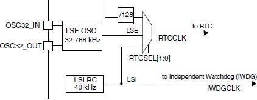

[//]: <> (Stm32. Переходим на современный C++. Часть 5. Система тактирования.)

# Вступление
На прошлом занятии мы начали рассматривать таймеры, а именно разобрали приемы работы
с базовым таймером. Наименьший период генерации события переполнения, который можно
получить, равен 1/8 мкс (при частоте тактирования таймера 8 Мгц и нулевых значениях
регистров предделителя и автоперезагрузки).
Однако даже в такой конфигурации невозможно реализовать хоть какой-нибудь обработчик прерывания,
который бы выполнялся с этой частотой, поскольку процессор выполняет (и это в лучшем случае)
одну инструкцию за один такт процессора.

Для повышения производительности напрашивается очевидное решение - увеличить частоту,
что равно увеличению количества выполняемых инструкций за единицу времени.

# Система тактирования в Stm32
Сразу рассмотрим рисунок из Reference Manual на линейку Stm32f103xB. У более продвинутых
контроллеров (типа Stm32f4) схема чуть сложнее, но некритично.


Последовательно рассмотрим составные части этой схемы.

## Тактирование системной шины и периферии
Ядро микропроцессора и его периферийные модули (кроме некоторых) тактируются от соответствующих
шин, главной из которых является **SYSCLK** - системня шина, от которой тактируются остальные шины
и периферийный модули по следующей иерархии:
**SYSCLK**
 - **модуль I2S2**
 - **модуль I2S3**
 - **шина AHB**
    - **модуль SDIO**
    - **модуль FSMC**
    - **модуль системного таймера (System timer)** с делением на 8
    - **шина APB1** с делением на 1, 2, 4, 6, 8, 16
        - **модули таймеров 2-7, 12-14**
    - **шина APB2** с делением на 1, 2, 4, 6, 8, 16
        - **модули таймеров 1, 8-11**
    - **модуль ADC** с деленим на 2, 4, 6, 8

Для других микроконтроллеров эта иерархия может отличаться, но все они
реализуют шинную архитектуру тактирования. В некоторых моделях
существует две шины AHB (AHB1 и AHB2), в некоторых присутствует шина APB3,
а в некоторых наоборот, есть только APB1.

В свою очередь системная шина через мултиплексор может тактироваться от одного
из трех источников:
- **HSI**: сигнал со входа HSI (High-speed internal) - внутреннего высокоскоростного генератора. Для рассматриваемого семейства он имеет частоту 8 Мгц;
- **PLLCLK**: сигнал со входа умножителя частоты с программируемым коэффициентом умножения и деления;
- **HSE**: сигнал со входа HSE (High-speed external) - внешнего 
высокоскоростного генератора. Данный источник реализован двумя входами **OSC_IN** и **OSC_OUT**, к которым должен быть подключен резонатор с частотой 4-16 Мгц.

Если с тактированием системной шины от HSI и HSE все понятно (частота 
системной шины равна частоте источника), то PLL стоит описать более подробно,
так как он программируемый и, как правило, в большинстве случаев именно он
является источником тактового сигнала, поскольку позволяет добиться максимально
возможной частоты работы микроконтроллера.

### Настройка PLL
В более простых контроллерах, к которым можно отнести и Stm32f103, на вход PLL
через мультиплексор (битом `PLLSRC`) можно подать либо сигнал с внутреннего высокоскоростного 
источника (HSI) с делителем, равным 2, либо сигнал с внешнего высокоскоростного источника (HSE), который, в свою  очередь, также через мультиплексор (битом `PLLXTPRE`) может иметь делитель 1 или 2.

На выходе PLL может быть получен сигнал с частотой, равной частоте входного сигнала PLL, 
умноженной на 2, 3, 4, ..., 16, что задается битами `PLLMUL`.

Таким образом, для популярной платы **Blue pill** с контроллером Stm32f103c8t6 максимальная
частота 72 Мгц может быть получена, например, умножением сигнала HSE (который, как правило,
имеет частоту 8 Мгц) на 9.

Необходимо учитывать, что для некоторых шин и модулей микроконтроллера существует ограничение
сверху на частоту тактового сигнала. Например, для Stm32f103 гина APB1 не может иметь частоту
более 36 Мгц, соответственно, при настройке системной шины на наивысшую скорость 72 Мгц
для корректной работы необходимо установить делитель шины APB1 в значение 2.

## Тактирование часов реального времени (RTC)

Поверхностно рассмотрим систему тактирования **часов реального времени** (Real-time clock, RTC),
ее схема приведена на рисунке.



**RTCCLK** - это линия, непосредственно тактирующая модуль часов реального времени.
Как можно заметить, данная линия является выходом мультиплексора с тремя входами,
который управляется битами `RTCSEL[1:0]`, позволяя выбрать один из следующих вариантов источника
тактового сигнала:
- **HSE/128**: сигнал со входа HSE с делением на 128;
- **LSE**: сигнал со входа LSE (Low-speed external). Данный источник тактового сигнала реализован двумя входами **OSC32_IN** и **OSC32_OUT**, к которым должен быть подключен резонатор с частотой 32.768 Гц;
- **LSI**: сигнал со входа LSI (Low-speed internal) - внутренний низкоскоростной источник тактового сигнала.
    Сигнал с него также тактирует независимый сторожевой таймер (Independent Watchdog, IWDG).

Более подробно потребители этих тактовых сигналов (а именно модули часов реального времени и сторожевого таймера)
будут рассмотрены далее. Сейчас же стоит отметить, что рекомендованным источником для RTC является внешний резонатор (LSI).

## Выход MCO


В сложных устройствах может потребоваться синхронизация между различными элементами, которой можно 
добиться путем получения тактирующего сигнала от микроконтроллера. В Stm32 эту функцию выполняет
выход **MCO** (Main clock output), который через мультиплексор позволяет выбрать один из следующих сигналов:
- **PLLCLK/2**: выход PLL с делением на 2;
- **HSI**:  сигнал с внутреннего высокоскоростного генератора;
- **HSE**:  сигнал с внешнего высокоскоростного генератора;
- **SYSCLK**: сигнал с системной шины.

## Библиотека Zhele и настройка тактирования
Библиотека Zhele содержит соответствующие типы данных (классы) для каждого 
элемента системы тактирования (источников сигнала, умножителя частоты, шин), 
позволяя тонко настраивать систему тактирования.

Для всех микроконтроллеров доступны классы `HsiClock` и `HseClock` со следущими интерфейсами (для упрощения примем, что все значения частоты, делителей, множителей имеют тип `uint32_t`):

- `constexpr uint32_t ClockFreq()` - возвращает частоту;
- `bool Enable()` - включает источник тактовой частоты;
- `bool Disable()` - выключает источник тактовой частоты.

Если посмотреть в библиотеку, то данные классы также содержат методы-заглушки
`uint32_t SrcClockFreq()` (возвращает частоту), `uint32_t GetDivider()`, `uint32_t GetMultipler()` (возвращают `1`). Эти методы добавлены для унификации источников тактовой частоты системной шины, потому что для одного из них - `PLL` - применимы понятия входного сигнала, делителя и множителя.

Класс PLL реализует следующие методы:
- `uint32_t SetClockFreq(uint32_t freq)` - осуществляет попытку настройки модуля PLL на заданную частоту, автоматически рассчитывая значения делителя и множителя. Возвращает итоговую частоту;
- `uint32_t SrcClockFreq()` - возвращает частоту входного для PLL сигнала (HSE или HSI, в зависимости от настройки мультиплексора);
- `uint32_t GetDivider()` - возвращает значение делителя;
- `void SetDivider(uint32_t divider)` - устанавливает значение делителя;
- `uint32_t GetMultipler()` - возвращает значение множителя;
- `void SetMultiplier(uint32_t divider)` - устанавливает значение множителя;
- `void SelectClockSource(ClockSource divider)` - задает источник тактового сигнала для PLL (тип `ClockSource` является перечислением с двумя возможными значениями: `Internal` и `External`);
- `ClockSource GetClockSource()` - возвращает источник тактового сигнала;
- `uint32_t ClockFreq()` - возвращает итоговую выходную частоту PLL;
- `bool Enable()` - включает источник тактовой частоты.
- `bool Disable()` - выключает источник тактовой частоты.

Данными тремя классами реализованы все возможные источники тактового сигнала для системной шины.

Системную шину реализует класс `SysClock`, который имеет следующий интерфейс:
- `uint32_t MaxFreq()` - возвращает максимальную разрешенную частоту тактирования системной шины;
- `ErrorCode SelectClockSource(ClockSource clockSource)` - осуществляет попытку 
  выбрать источник тактирования системной шины. `ClockSource` - это перечисление с возможными значениями `Internal`, `External`, `Pll`, задающими в качестве
  источника тактового сигнала HSI, HSE, PLL соответственно. Тип результата - 
  `ErrorCode` - также является перечислением с возможными значениями `Success` 
  (успех), `ClockSourceFailed` (ошибка включения источника), `InvalidClockSource`
  (некорректно выбран источник тактового сигнала), `ClockSelectFailed` - ошибка выбора
  тактового сигнала.

- `uint32_t ClockFreq()` - возвращает итоговую частоту системной шины;
- `uint32_t SrcClockFreq()` - возвращает частоту источника сигнала (совпадает с частотой самой шины);
- `uint32_t SetClockFreq(uint32_t freq)` - осуществляет попытку настройки системной
    шины на заданную частоту, автоматически рассчитывая значения делителя и
    множителя. Возвращает итоговую частоту;

В зависимости от конкретного контроллера в библиотеке могут быть доступны классы
остальных шин, для Stm32f103 это `AhbClock`, `Apb1Clock`, `Apb2Clock`, которые имеют следующий интерфейс:
- `uint32_t ClockFreq()` - возвращает итоговую частоту шины;
- `void SetPrescaler(Prescaler prescaler)` - задает делитель частоты шины, тип `Prescaler` является перечислением, конкретные значения которого заданы для каждой шины индивидуально (например, для класса `AhbClock` доступны значения `Div1`, `Div2`, `Div4`, `Div8`, `Div16`, `Div64`, `Div128`, `Div256`, `Div512`), а для классов `Apb1Clock` и `Apb2Clock` только `Div1`, `Div2`, `Div4`, `Div6`, `Div16`.

Помимо классов, реализующих источники тактового сигнала и шины, библиотека реализует шаблон класса для управления тактированием периферией:
```c++
template<typename _Reg, unsigned _Mask, typename _ClockSrc>
class ClockControl :public _ClockSrc
{
public:
    // Включает тактирование
    static void Enable();
    
    // Выключает тактирование
    static void Disable();
};
```

и набор соответствующих специализаций этого шаблона, например:
```c++
using Tim2Clock = ClockControl<PeriphClockEnable1, RCC_APB1ENR_TIM2EN, Apb1Clock>;
```

Таким образом, для всей периферии доступен соответствущий тип (специализация шаблона), позволяющий включать и отключать тактирование этой периферии.

## Пример настройки тактирования
Модифицируем пример с прошлого занятия, предварительно настроив
системную шину на частоту 72 Мгц (путем умножения сигнала с HSE на 9).
Для того, чтобы светодиод по-прежнему изменял состояние раз в секунду, необходимо изменить
значения предделителя и регистра перезагрузки таймера. Например, установить предделитель в значение _12000_, а регистр перезагрузки в _6000_.

```c++
#include <clock.h>
#include <iopins.h>
#include <timer.h>

using namespace Zhele::Clock;
using namespace Zhele::IO;
using namespace Zhele::Timers;

using Led = Pc13Inv;
using LedTimer = Timer2;

int main()
{
    // Настройка тактирования
    // Выбираем HSE как источник для PLL
    PllClock::SelectClockSource(PllClock::External);
    // Устанавливаем коэффициент умножения
	PllClock::SetMultiplier(9);
	// Устанавливаем делитель шины APB1 (ее макс.частота равно 36 МГц)
	Apb1Clock::SetPrescaler(Apb1Clock::Div2);
	// Выбираем PLL как источник для тактирования системной шины
	SysClock::SelectClockSource(SysClock::Pll);

    // Настройка светодиода
    Led::Port::Enable();
    Led::SetConfiguration(Led::Configuration::Out);
    Led::SetDriverType(Led::DriverType::PushPull);
    Led::Clear();

    LedTimer::Enable();
    LedTimer::SetPrescaler(11999); // Предделитель = 12000
    LedTimer::SetPeriod(3999); // Период = 4000. Итого период таймера = 72000000/12000/4000 = 1.
    LedTimer::EnableInterrupt();
    LedTimer::Start();

    for (;;)
    {
    }
}

extern "C"
{
    void TIM2_IRQHandler()
    {
        // Изменение состояния светодиода
        Led::Toggle();
        // Сброс флага прерывания
        LedTimer::ClearInterruptFlag();
    }
}
```

Полный код примера, как обычно, доступен на [Яндекс.Диске](https://disk.yandex.ru/d/T4msTiJYfdsnlA).

На следующем занятии мы продолжим изучение таймеров, а именно рассмотрим вопросы
применения таймеров общего назначения и каналов сравнения.