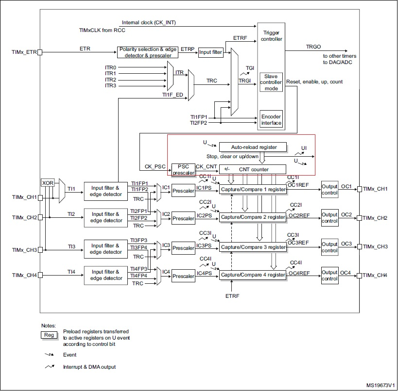

[//]: <> (Stm32. Переходим на современный C++. Часть 6. Таймеры. Таймеры общего назначения и модуль сравнения.)

# Вступление
Прошу прощения, если кого-то расстроил столь долгим перерывом, но конец года постоянно не оставляет ни минуты
свободного времени.

Ранее мы начали изучение таймеров в контроллерах Stm32 и рассмотрели базовый таймер, функционал которого
ограничен увеличением счетчика (регистра **CNTR**) и генерацией события (на которое можно "повесить" прерывание и DMA-запрос)
при его переполнении.

Переходим к следующему в иерархии виду таймеров - **таймерам общего назначения** (general-purpose).

# Таймеры общего назначения в Stm32
В контроллерах, как правило, представлено несколько таймеров общего назначения, которые, в свою
очередь, согласно Reference Manual можно разбить на несколько групп с незначительными отличиями, к которым
относятся:
- разрядность счетчика (некоторые таймеры общего назначения могут быть 32-битными, например, "таймер 2" для контроллеров Stm32f0x);
- направление счета (некоторые считают только вверх, некоторые позволяют вести счет вниз или вверх/вниз);
- количество каналов захвата/сравнения (два или четыре);
- поддержка внешнего триггера/сигнала тактирования (некоторые таймеры имеют, некоторые нет).

Конкретные возможности того или иного таймера можно найти в Reference Manual,
мы же рассмотрим полный список возможностей таймеров общего назначения.

К основным возможностям, согласно Reference Manual, можно отнести следующее:
- 16/32-битный счетчик автоперезагрузкой (прямого, обратного, прямого/обратного счета);
- 16-битный программируемый предделитель, используемый для деления входного
тактирующего сигнала на любое значение в промежутке 1..65536;
- до 4 независимых каналов для
  - захвата;
  - сравнения;
  - генерации ШИМ;
  - выхода в режиме one-pulse.
- схема синхронизации с внешними сигналами и другими таймерами;
- генерация прерывания/DMA-запроса для следующих событий:
  - обновление счетчика (переполнение вверх/вниз, сброс таймера (программный или по триггеру)
  - событие триггера (начала/остановка счета)
  - событие захвата
  - событие сравнения
- поддержка инкрементного (квадратурного) энкодера и датчика Холла
- вход триггера для внешнего тактирования

На рисунке ниже представлена диаграмма блока базового таймера, где красным цветом выделена часть, общая с рассмотренным ранее базовым таймеров.




Несложно увидеть, что непосредственно счет (он же целиком базовый таймер) - это
лишь малая часть полного модуля таймера, поэтому последовательно разберем составные части таймеров общего назначения.

## Линия **Internal clock (CK_INT)**

**CK_INT** - внутренний тактирующий сигнал от шины, используется для "обычного" тактирования таймера от системной шины.

## Вход **TIMx_ETR**
**TIMx_ETR** - вход для внешнего сигнала, который можно использовать как триггер или тактовый сигнал.
Сигнал с этого входа проходит через два промежуточных модуля:
  - **Polarity selection & edge detector & prescaler** выполняет следующие функции:
    - *выбор полярности*: вход **ETR** может быть неинвертированным, в этом случае активным считается высокий уровень или восходящий фронт,
      либо инвертированным, при котором активным считается низкий уровень или нисходящий фронт. Настройка задается битом **ETP** регистра **TIMx_SMCR**;
    - *детектор фронтов*;
    - *настраиваемый предделитель*: выходной сигнал модуля может иметь частоту не более 1/4 частоты **CK_INT**, поэтому в случае высокочастотного входного
      сигнала может быть полезным его деление. Доступно деление на 1, 2, 4, 8, настройка задается битами **ETPS** регистра **TIMx_SMCR**.
  - **Input filter** является цифровым фильтром для сигнала **ETRP**, его настройка задается битами **ETF** регистра **TIMx_SMCR**, конкретное описание значений
    можно найти в Reference Manual.

## Входы **ITR0 ... ITR4**
Каждый вход **ITRx** является внутренней линией к другому таймеру (мастер-таймеру), конкретное их перечисление указано в Reference Manual.
Например, для таймера 2 контроллера *Stm32f103* **ITR0 ... ITR1** подключены соответственно к таймерам 1, 8, 3, 4. Мультиплексор позволяет
выбрать одну из четерых линий в качестве выходной, что задается двумя битами младшими **TS** регистра **TIMx_SMCR**.

## Входы **TI1FP1** и **TI2FP2**
Эти линии являются выходами детектора фронтов первого канала, поэтому будут описаны ниже.

## Trigger controller
Перечисленные выше линии после цепочек деления частоты, фильтрации и мультиплексирования в итоге попадают в модуль **Trigger controller**,
который имеет два выхода:
  - **TRGO**: выход для синхронизации с другими таймерами (те самые линии **ITRx**) и запуска ЦАП/АЦП. Выход активируется битом **MSM** регистра **TIMx_SMCR**;
  - **Reset, enable, up, count** - линия (точнее несколько) управления счетом таймера, где
    - **reset** - сброс счетчика;
    - **enable** - активация (запуск) таймера;
    - **up** - направление счета;
    - **count** - сигнал счета (изменения счетчика на единицу вверх/вниз).
  
    Данный выход настраивается с помощью битов **SMS** регистра **TIMx_SMCR** и может иметь следующие значения:
    - **000 (*Slave mode disabled*)** : slave-режим отключен, таймер тактируется от линии **CK_INT**;
    - **001 (*Encoder mode 1*)**: режиме энкодера 1, счетчик изменяется по фронту
      **TI2FP1** на единицу вверх/вниз в зависимости от состояния **TI1FP2**;
    - **010 (*Encoder mode 2*)**: режиме энкодера 2, счетчик изменяется по фронту
      **TI1FP2** на единицу вверх/вниз в зависимости от состояния **TI2FP1**;
    - **011 (*Encoder mode 3*)**: режиме энкодера 3, счетчик изменяется по фронтам 
      **TI1FP1** и **TI2FP2** на единицу вверх/вниз в зависимости от их состояния;
    - **100 (*Reset Mode*)**: режим сброса, выбранный триггер сбрасывает счетчик;
    - **101 (*Gated Mode*)**: режима шлюза, счетчик включен только при высоком уровне сигнала
      триггера. При переходе его в низкий уровень счет останавливается, **но 
      счетчик не сбрасывается**. При переходе триггерного сигнала обратно в высокий
      уровень счет возобновляется;
    - **110 (*Trigger Mode*)**: режим триггера, счет запускается по восходящему фронту триггерного 
      сигнала (счетчик не сбрасывается, при переходе триггерного сигнала в низкий
      уровнеь ничего не происходит);
    - **111 (*External Clock Mode 1*)**: режим внешнего тактирования, триггерный сигнал управляет изменением
      счетчика.

На этом верхняя часть схемы таймера закончилась и она похожа на базовый таймер,
но с продвинутыми возможностями управления счетчиком.

# Режим сравнения
В базовом таймере единственным событием было переполнение счетчика, таймеры общего назначения
позволяют реагировать (то есть генерировать событие) при достижении счетчиком заданного значения.
Такой режим работы называется **режимом сравнения**.

В таймерах общего назначения есть 4 канала захвата/сравнения (про захват читайте в следующей статье),
каждый из которых управляется двумя регистрами:
  - **TIMx_CCRy** (где **y** - номер канала) - позволяет задать значение, при достижении счетчиком
    таймера которого происходит срабатывание канала сравнения;
  - **TIMx_CCMRy** (где **y** = номер канала / 2, то есть 1 и 2 каналы делят регистр **TIMx_CCMR1**,
    а 3 и 4 - регистр **TIMx_CCMR2**.

Рассмотрим возможные функции канала в режиме сравнения, которые могут быть заданы битами
**OCxM** соответствующего регистра:
  - **000 (*Frozen*)**: сравнение счетчикам таймера с регистром **CCRy** не имеет никакого эффекта;
  - **001**: выход **OCyREF** устанавливается в высокий уровень при совпадении счетчика с регистром
    **CCRy**;
  - **010**: обратный режим, выход **OCyREF** устанавливается в низкий уровень при
    совпадении счетчика с регистром **CCRy**;
  - **011 (*Toggle*)**: выход **OCyREF** инвертируется при совпадении счетчика с регистром **CCRy**;
  - **100 (*Force inactive level*)**: выход **OCyREF** принудительно в низком уровне;
  - **101 (*Force active level*)**: выход **OCyREF** принудительно в высоком уровне;
  - **110 (*PWM mode 1*)**: решим ШИМ 1, при счете вверх выход **OCyREF** имеет высокий уровень
    пока **TIMx_CNT < TIMx_CCR1**, иначе низкий. При счете вниз выход **OCyREF** имеет низкий
    уровень пока **TIMx_CNT > TIMx_CCR1**;
  - **110 (*PWM mode 2*)**: решим ШИМ 2, при счете вверх выход **OCyREF** имеет низкий уровень
    пока **TIMx_CNT < TIMx_CCR1**, иначе низкий. При счете вниз выход **OCyREF** имеет высокий
    уровень пока **TIMx_CNT > TIMx_CCR1**.

Выход **OCyREF** проходит через модуль **Output control** и попадает на выход **TIMx_CHy**.
Для каждого канала в **Output control** доступно два бита настройки:
  - **CCyE (Capture/Compare y output enable)**, если равен **0**, канал неактивен, если равен **1**,
    то выход зависит от уровня **OCyREF**;
  - **CCyP (Capture/Compare y output polarity)**, если равен **00**, то выход является
    неинвертированным, то есть уровень выхода **TIMx_CHy** совпадает **OCyREF**, иначе наоборот.

Помимо изменения состояния выхода каждый канал сравнения позволяет сгенерировать прерывание
по сравнению (момент совпадения счетчика с регистром **CCRy**), что активируется битом
**CCyE** регистра **TIMx_DIER**, и активировать запрос DMA (бит **CCyD** регистра **TIMx_DIER**).

В целом возможности каналов таймера в режиме сравнения можно сформулировать как **реагирование
на совпадение счетчика таймера с заданным значением в виде изменения состояния выхода или
генерации прерывания/запроса DMA**.

# Интерфейс библиотеки Zhele для таймеров общего назначения
В библиотеке Zhele функционал таймера общего назначения реализован шаблонном класса `GPTimer`,
который является производным от класса `BaseTimer` и, соответственно, предоставляет те
же возможности, что и базовый таймер.

Для использования всех возможностей класс имеет следующие вложенные классы:
  - `SlaveMode`: класс для управления функциями таймера как ведомого;
  - `ChannelBase`: шаблон класса, реализующий общие функции канала (и захвата, и сравнения);
  - `InputCapture`: шаблон класса, реализующий канал захвата;
  - `OutputCompare`: шаблон класса, реализующий канал сравнения;
  - `PWMGeneration`: шаблон класса, реализующий канал ШИМ.

## GPTimer::SlaveMode
Вложенный шаблон класса `SlaveMode` (параметризуется номером канала) имеет следующие методы:

- `void EnableSlaveMode(Mode mode)` - включает ведомый режим, тип `Mode` является перечислением
  со следующими значениями:
  - `SlaveModeDisabled`
  - `EncoderMode1`
  - `EncoderMode2`
  - `EncoderMode3`
  - `ResetMode`
  - `GatedMode`
  - `TriggerMode`
  - `ExternalClockMode`
  
  Комментировать их нет необходимости, поскольку имена значения перечисления полностью совпадают
  с описанием значений битов **SMS** из Reference Manual;

- `void DisableSlaveMode()` - отключает режим ведомого;
- `void SelectTrigger(Trigger trigger)` - выбирает триггер, тип `Trigger` является перечислением
  со следующими значениями:
  - `InternalTrigger0`;
  - `InternalTrigger1`
  - `InternalTrigger2`
  - `InternalTrigger3`
  - `Ti1EdgeDetector`
  - `FilteredTimerInput1`
  - `FilteredTimerInput2`
  - `ExternalTriggerInput`

- `void SetTriggerPrescaler(ExternalTriggerPrescaler prescaler)` - устанавливает делитель для триггератип `Trigger` является перечислением
  со следующими значениями:
  - `PrescalerOff`;
  - `Divide2`
  - `Divide4`
  - `Divide8`

## GPTimer::ChannelBase

Вложенный шаблон класса `OutputCompare` имеет следующие методы:
- `void EnableInterrupt()` - включает прерывание канала по событию захвата/сравнения;
- `void DisableInterrupt()` - отключает прерывание канала по событию захвата/сравнения;
- `bool IsInterrupt()` - показывает, установлен ли флаг прерывания канала;
- `void ClearInterruptFlag()` - сбрасывает флаг прерывания канала;
- `void EnableDmaRequest()` - включает запрос DMA по событию захвата/сравнения;
- `void DisableDmaRequest()` - отключает запрос DMA;
- `void Enable()` - включает канал;
- `void Disable()` - отключает канал.

## GPTimer::OutputCompare

Вложенный шаблон класса `OutputCompare` имеет следующие методы:
- `void SetPulse(typename Base::Counter pulse)` - устанавливает значение регистра **CCRy**;
- ` Base::Counter GetPulse()` - возвращает текущее значение регистра **CCRy**;
- `void SetOutputPolarity(OutputPolarity polarity)` - устанавливает выходную полярность,
  тип `OutputPolarity` является перечислением со значениями `ActiveHigh` и `ActiveLow` для
  неинвертированного и инвертированного режима соответственно.
- `void SetOutputMode(OutputMode mode)` - устанавливает режим выхода, тип `OutputMode` является
  перечисленим со следующими значениями:
  - `Timing` - выход отключен;
  - `Active` - высокий уровень на выходе по сравнению;
  - `Inactive` - низкий уровень на выходе по сравнению;
  - `Toggle` - переключение уровня по сравнению
  - `PWM1` - режим ШИМ 1;
  - `PWM2` - режим ШИМ 2;
  - `ForcedActive` - принудительно высокий уровень;
  - `ForcedInactive` - принудительно низкий уровень.
- `void SelectPins(int pinNumber)` и его шаблонные вариации - выбор линии выхода.

## GPTimer::PWMGeneration

Вложенный шаблон класса `PWMGeneration` (параметризуется номером канала
и является производным от `OutputCompare`) имеет следующие методы:

- `void SetOutputFastMode(FastMode mode)` - настраивает **Fast Mode**, тип `FastMode` является
  перечислением со значениями `Disable` и `Enable`;
- `void SelectPins(int pinNumber)` и его шаблонные вариации - выбор линии выхода.

# Пример
Уместить все возможности таймера общего назначения в один пример нелегко, поэтому
используем одну из наиболее популярных функций - генерация ШИМ-сигнала для управления,
например, яркостью светодиода.

```c++
#include <iopins.h>
#include <timer.h>

using namespace Zhele::IO;
using namespace Zhele::Timers;

using PwmChannel = Timer3::PWMGeneration<1>;

int main()
{
  // Включает порт
  Pa7::Port::Enable();

  // Настраиваем таймер 3, частота переполнения составляет 
  Timer3::Enable();
  Timer3::SetPrescaler(799);
  Timer3::SetPeriod(100); // Значение регистра сравнения может быть в промежутке 1..99
    
  // Выбор выхода канала (A7)
  PwmChannel::SelectPins<Pa7>();
  // Включение канала
  PwmChannel::Enable();
  // Настройка режима выхода канала
  PwmChannel::SetOutputMode(PwmChannel::OutputMode::PWM1);
  // Настройка коэффициента заполнения
  PwmChannel::SetPulse(50); // 50% заполнение
  // Включение таймера
  Timer3::Start();
    
  for (;;)
  {
  }
}
```

Полный код примера, как обычно, доступен на [Яндекс.Диске](https://disk.yandex.ru/d/tMnU86pCpZRfrw).
