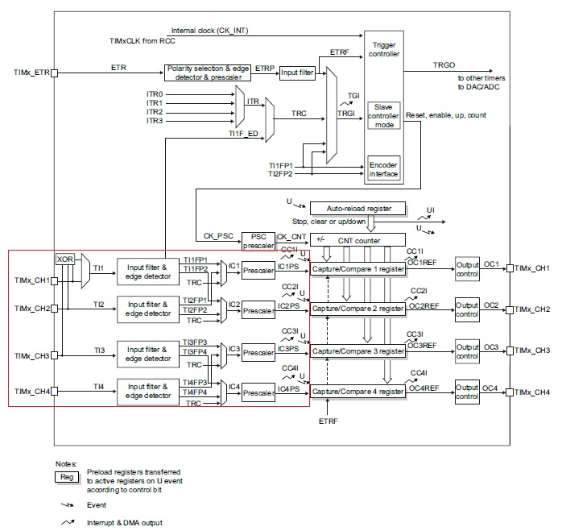
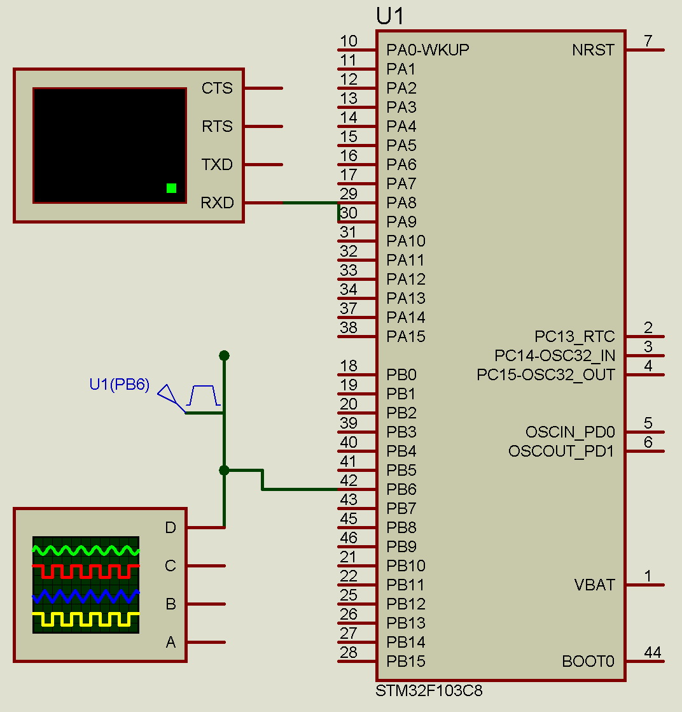
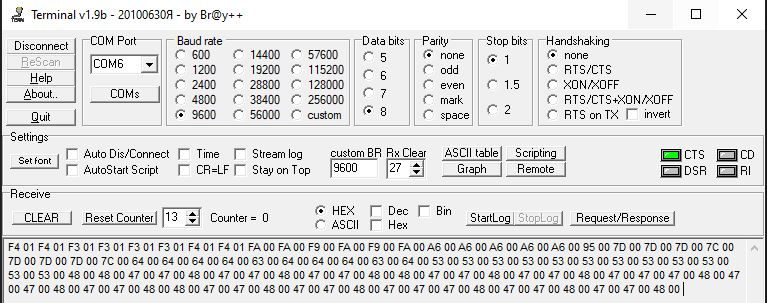

[//]: <> (Stm32. Переходим на современный C++. Часть 7. Таймеры. Таймеры общего назначения и модуль захвата.)

# Вступление

В предыдущем материале мы рассмотрели таймер общего назначения и использование каналов сравнения
(скоро планирую подготовить материал с более объемными примерами), сегодня же к изучению предлагается
второй компонент - **каналы сравнения**.

# Каналы сравнения

Снова обратимся к диаграмме блока таймера общего назначения, где красным цветом выделены
каналы захвата (до четырех для одного таймера) и разберем составные части схемы.



## Линии **TIMx_CH1 ... TIMx_CH4**
Линии **TIMx_CH1 ... TIMx_CH4** являются входами каналов таймера, на которые, как правило,
поступает внешний сигнал, параметры которого необходимо измерять.

## Блок **Input filter & edge detector**
Сигнал с входа попадает на модуль фильтрации и детектирования фронтов

# Режим захвата
Каждый канал таймера помимо выполнения функции сравнения, рассмотренной на прошлом уроке,
позволяет фиксировать (сохранять) текущее значение счетчика таймера (**TIM_CNTR**) при
наступлении некоторого события на входе канала (а событий может быть только два - 
изменение сигнала с низкого уровня на высокий и наоборот).

Как было сказано в предыдущем материале, каждый канал может работать (независимо от остальных)
либо в режиме сравнения, либо в режиме захвата, в связи с чем оба этих режима для своего
конфигурирования делят два регистра для настройки, биты которых, в зависимости от текущего режима,
имеют разный смысл.

- **TIMx_CCRy** (где **y** - номер канала) - позволяет задать значение, при достижении счетчиком
  таймера которого происходит срабатывание канала сравнения;
- **TIMx_CCMRy** (где **y** = номер канала / 2, то есть 1 и 2 каналы делят регистр **TIMx_CCMR1**,
  а 3 и 4 - регистр **TIMx_CCMR2**)  - регистр конфигурации канала захвата.

Вход **TIy** проходит через модуль **Input filter & edge detector**, для каждого канала
в регистре **TIMx_CCER** доступно два бита настройки:
  - **CCyE (Capture/Compare y output enable)**, если равен **0**, канал неактивен, если равен **1**,
    то выход зависит от уровня **OCyREF**;
  - **CCyP (Capture/Compare y output polarity)**, если равен **0**, то выход является
    неинвертированным и событие захвата происходит по восходящему фронту сигнала.
    Если бит равен **1**, то вход считается инвертированным и событие захвата происходит
    по нисходящему фронту сигнала

Рассмотрим возможные функции канала в режиме захвата, которые могут быть заданы полями
**CCyS, ICyPSC, ICyF** соответствующего регистра (где **y** - номер канала).

Биты **CCyS[1:0]** предназначены для конфигурирования мультиплексора соответствующего канала
и позволяют выбрать источник сигнала линии **ICy** и могут принимать следующие значения:
  - **00** - канал настроен в режиме сравнения, смотри предыдущий урок;
  - **01** - линия **TIy** является источником **ICy**;
  - **10** - линия **TIy +- 1** является источником **ICy**
    (то есть "соседний" вход: для **IC1** - **TI2**, для **IC2** - **TI1**, для **IC3** - **TI4**, для **IC4** - **TI3**);
  - **11** - линия **TRC** является источником **ICy** (**TRC** - это выход мультиплексора триггерного
    сигнала, смотри предыдущий урок).

Биты **ICyPSC[1:0]** предназначены для настройки предделителя входного сигнала
канала захвата и могут принимать следующие значения:
  - **00** - нет деления (делитель равен 1), захват происходит на каждое событие обнаружение фронта входного сигнала;
  - **01** - захват происходит на каждое второе событие обнаружение фронта входного сигнала (делитель равен 2);
  - **10** - захват происходит на каждое четвертое событие обнаружение фронта входного сигнала (делитель равен 4);
  - **11** - захват происходит на каждое восьмое событие обнаружение фронта входного сигнала (делитель равен 8).

Биты **ICyF[3:0]** предназначены для настройки цифрового фильтра сигнала канала захвата, подробное 
описание значений можно посмотреть в Reference Manual.

При наступлении события захвата (изменения состояния линии **ICy**) таймер помещает в регистр
**TIMx_CCRy** текущее значение счетчика и позволяет сгенерировать прерывание (бит **CCyE** регистра **TIMx_DIER**)
или запрос DMA (бит **CCyD** регистра **TIMx_DIER**).

# Интерфейс библиотеки Zhele для таймеров общего назначения
В библиотеке Zhele функционал модуля захвата таймера общего назначения реализован
вложенным шаблонном класса `GPTimer::InputCapture`, являющийся производным от шаблона
класса `GPTimer::ChannelBase`

## GPTimer::ChannelBase

*Этот раздел в точности совпадает с предыдущий уроком и продублирован для удобства чтения полного списка методов, доступных для модуля захвата.*

Вложенный шаблон класса `ChannelBase` имеет следующие методы:
- `void EnableInterrupt()` - включает прерывание канала по событию захвата/сравнения;
- `void DisableInterrupt()` - отключает прерывание канала по событию захвата/сравнения;
- `bool IsInterrupt()` - показывает, установлен ли флаг прерывания канала;
- `void ClearInterruptFlag()` - сбрасывает флаг прерывания канала;
- `void EnableDmaRequest()` - включает запрос DMA по событию захвата/сравнения;
- `void DisableDmaRequest()` - отключает запрос DMA;
- `void Enable()` - включает канал;
- `void Disable()` - отключает канал.

## GPTimer::InputCapture

Вложенный шаблон класса `InputCapture` имеет следующие методы:
- `void SetCapturePolarity(CapturePolarity polarity)` - устанавливает полярность входного сигнала
  (по какому фронту происходит событие захвата), тип `CapturePolarity` является перечислением со следующими значениями:
    - `RisingEdge` - захват по восходящему фронту;
    - `FallingEdge` - захват по нисходящему фронту;
    - `BothEdges` - захват по обоим фронтам (**доступно не для всех таймеров/каналов, читайте RM!**).
  
- `void SetCaptureMode(CaptureMode mode)` - устанавливает источник сигнала канала (мультиплексор для **ICy**),
  тип `CaptureMode` является перечислением со следующими значениями:
    - `Direct` - прямой (источником **ICy** является **TIy**);
    - `Indirect` - непрямой (источником **ICy** является соседний **TIy**);
    - `CaptureTrc` - источником **ICy** является **TRC**.

- `Base::Counter GetValue()` - возвращает значение, записанное в регистр **TIMx_CCRy**;
- `void SelectPins(int pinNumber)` и его шаблонные вариации - выбор линии выхода.

# Пример
Наиболее очевидным применением модуля захвата является измерение длительности входного импульса (а также периода сигнала),
поэтому в качестве демонстрации возможностей библиотеки **Zhele** предлагается реализовать соответствующую программу.

На самом деле данная задача может решаться несколькими способами, например:
 1. Подключение сигнала на вход двух каналов, один "ловит" начало импульса (захват по восходящему фронту),
    а второй наоборот - конец (нисходящий фронт). Длительность равна разнице регистров **CCR**.
 2. Почти то же самое, только сигнал подключен только к одному входу **TIMx_CH**, а настройками
    мультиплексоров (один канал использует режим `Direct`, а другой `Indirect`) этот сигнал подключается
    к двум каналам. Таким образом, подобными настройками ситуация сводится к пункту **1**.
 3. Сигнал подключен к одному входу **TIMx_CH**, в режим `Indirect` он подключается к "соседнему" каналу, а сам
    таймер настраивается в роли ведомого (Slave) с режимом сброса по триггеру, причем источником триггера
    является канал таймера, настроенный в прямом режиме. Таким образом, восходящий фронт приведет к 
    срабатываниию триггера и сбросу счетчика в 0, а нисходящий - к событию захвата. В этом случае
    в соответствующем регистре **CCR** сразу лежит длительность и вычислять разницу не нужно.
    
    Этот способ мы применим позже при изучении ведомого режима таймера.

Пока же остановимся на варианте под номером **2**.

## Схема
Предложенная задача является уже более сложной, чем примеры из предыдущих уроков, поэтому
сначала разработаем схему. Для получения значений в программу будет добавлен вывод в порт UART,
пока можно считать это "магией", так как в дальнейшем мы обязательно рассмотрим
вопросы передачи данных, включая UART.



Схема максимально примитивная и содержит всего 4 элемента:
1. Сам микроконтроллер *Stm32F103C8T6*
2. Терминал для приема данных;
3. Генератор прямоугольного сигнала;
4. Осциллограф (чтобы наблюдать за сигналом).

В моем случае реальный стенд собран из следующих компонентов:
1. Отладочная плата *BluePill*;
2. Преобразовать USB<->UART и утилита *Termilal v1.9b*;
3. Осциллограф (**не пинайте меня!!!**) Fnirsi-1014d со встроенным генератором.

## Код

```c++
#include <iopins.h>
#include <timer.h>
#include <usart.h>

using UsartConnection = Zhele::Usart1;

using InputTimer = Zhele::Timers::Timer4;
using InputCaptureRising = InputTimer::InputCapture<0>;
using InputCaptureFalling = InputTimer::InputCapture<1>;

void ConfigureUart();
void ConfigureTimer();

int main()
{
    // Включение и конфигурирование UART
    ConfigureUart();
    // Включение и конфигурирование таймера и каналов захвата
    ConfigureTimer();

    for (;;)
    {
    }
}

// Настройка UART
void ConfigureUart()
{
    UsartConnection::Init(9600);
    UsartConnection::SelectTxRxPins<Zhele::IO::Pa9, Zhele::IO::Pa10>();
    UsartConnection::WriteAsync("Hello", 5);
}

void ConfigureTimer()
{
    // Включение таймера
    InputTimer::Enable();
    // Установка предделителя
    InputTimer::SetPrescaler(7999); // 8 МГц / 8000 = 1 КГц. 1 тик = 1 мс
    InputTimer::SetPeriod(65535); // Максимальный период (так что можем игнорировать случаи, когда CCR1 > CCR2)

    // Выбираем линию PB6 как вход канала 1
    InputCaptureRising::SelectPins<Zhele::IO::Pb6>();
    // Захват по восходящему фронту
    InputCaptureRising::SetCapturePolarity(InputCaptureRising::CapturePolarity::RisingEdge);
    // Прямой режим (источник сигнала для 1 канала - CH1)
    InputCaptureRising::SetCaptureMode(InputCaptureRising::CaptureMode::Direct);
    // Включение канала
    InputCaptureRising::Enable();

    // Захват по нисходящему фронту
    InputCaptureFalling::SetCapturePolarity(InputCaptureFalling::CapturePolarity::FallingEdge);
    // Непрямой режим (источник сигнала для 2 канала - CH1, тот же PB6)
    InputCaptureFalling::SetCaptureMode(InputCaptureFalling::CaptureMode::Indirect);
    // Активация прерывания по захвату
    InputCaptureFalling::EnableInterrupt();
    // Включение канала
    InputCaptureFalling::Enable();

    // Запуск таймера
    InputTimer::Start();
}

extern "C"
{
    // Обработчик прерывания от таймера 4
    void TIM4_IRQHandler()
    {
        // Так как все события таймера делят одно прерывание, то необходимо различать причины
        // В нашем случае можно было этот условный оператор не применять, так как
        // только событие захвата канала InputCaptureRising приводит к прерыванию
        if (InputCaptureFalling::IsInterrupt())
        {
            // Вычисление длительности, так как 1 тик таймера = 1 мс, получаем результат сразу в мс
            uint16_t duration = InputCaptureFalling::GetValue() - InputCaptureRising::GetValue();
            // Сброс прерывания
            InputCaptureFalling::ClearInterruptFlag();
            // Асинхронная (с DMA) отправка длительности в UART
            UsartConnection::WriteAsync(&duration, sizeof(duration));
        }
    }
}
```

## Результаты эксперимента
Встроенный в осциллограф генератор настроен в режим генерации прямоугольного сигнала
со скважностью 50%, то есть для сигнала частотой 1 Гц на входе PB6 500мс низкий уровень,
500мс высокий. Далее частота сигнала последовательно шесть раз увеличивается на 1 Гц (то есть до 7 Гц),
а в программе можно наблюдать принятые от микроконтроллера данные (по 2 байта на каждый импульс).



На рисунке можно выделить последовательности однаковых (почти) чисел:
1. **0x01F3** (что равно **499**) - длительность сигнала высокого уровня на частоте 1 Гц;
2. **0x00FA** (что равно **250**) - длительность сигнала высокого уровня на частоте 2 Гц;
3. **0x00A6** (что равно **166**) - длительность сигнала высокого уровня на частоте 3 Гц;
4. **0x007D** (что равно **125**) - длительность сигнала высокого уровня на частоте 4 Гц;
5. **0x0064** (что равно **100**) - длительность сигнала высокого уровня на частоте 5 Гц;
6. **0x0053** (что равно **83**) - длительность сигнала высокого уровня на частоте 6 Гц;
7. **0x0047** (что равно **71**) - длительность сигнала высокого уровня на частоте 7 Гц;

Таким образом, получился примитивный частотомер!

Полный код примера, как обычно, доступен на [Яндекс.Диске](https://disk.yandex.ru/d/MS9WAeL-XBzYsA).