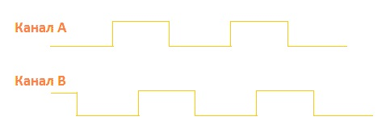

[//]: <> (Stm32. Переходим на современный C++. Часть 8. Таймеры. Режим энкодера. Режимы Master/Slave.)

# Вступление

В завершение изучения таймеров, в частности таймеров общего назначения, рассмотрим оставшийся
без внимания блок - **Trigger controller**:

# Таймер в режиме ведомого
Таймеры так же могут работать в режиме ведомого с реакцией на внешнее событие, задаваемой
битами **SMS** регистра **TIMx_SMCR**:
- **100 (*Reset Mode*)**: режим сброса, выбранный триггер сбрасывает счетчик;
- **101 (*Gated Mode*)**: режима шлюза, счетчик включен только при высоком уровне сигнала
  триггера. При переходе его в низкий уровень счет останавливается, **но 
  счетчик не сбрасывается**. При переходе триггерного сигнала обратно в высокий
  уровень счет возобновляется;
- **110 (*Trigger Mode*)**: режим триггера, счет запускается по восходящему фронту триггерного 
  сигнала (счетчик не сбрасывается, при переходе триггерного сигнала в низкий
  уровнеь ничего не происходит);
- **111 (*External Clock Mode 1*)**: режим внешнего тактирования, триггерный сигнал управляет изменением счетчика.

Источником триггерного сигнала могут служить:
- выходы **TRGO** других таймеров (мастер-таймеров),
конкретные списки можно найти в Reference Manual;
- внешняя линия **ETR**;
- сигнал детектора фронта первого канала таймера;
- сигналы 1 и 2 каналов таймера после фильтрации (**TI1FP1** и **TI2FP2**).

Источник триггерного сигнала задается битами **TS** регистра **TIMx_SMCR**:
- **000***: источником триггерного сигнала является внутренний триггер **ITR0**;
- **001***: источником триггерного сигнала является внутренний триггер **ITR1**;
- **010***: источником триггерного сигнала является внутренний триггер **ITR2**;
- **011***: источником триггерного сигнала является внутренний триггер **ITR3**;
- **100***: источником триггерного сигнала является детектор фронта первого канала **TI1F_ED**;
- **101***: источником триггерного сигнала является фильтрованный сигнал первого канала **TI1FP1**;
- **110***: источником триггерного сигнала является фильтрованный сигнал второго канала **TI2FP2**;
- **111***: источником триггерного сигнала является внешний сигнал **ETRF**.

## Библиотека Zhele и ведомый режим таймера
Для тонкой настройки поведеним таймера по внешнему событию класс таймера содержит
вложенный класс `SlaveMode`, предоставляющий следующий интерфейс:
- `void EnableSlaveMode(Mode mode)`: активирует режим ведомого, `Mode` является перечислением со следующими возможными значениями:
  - `SlaveModeDisabled` - режим ведомого отключен;
  - `EncoderMode1` - режим энкодера **1**;
  - `EncoderMode2` - режим энкодера **2**;
  - `EncoderMode3` - режим энкодера **3**;
  - `ResetMode` - режим сброса счетчика;
  - `GatedMode` - режим шлюза;
  - `TriggerMode` - режим триггера;
  - `ExternalClockMode` - режим внешнего тактирования.
- `void DisableSlaveMode()`: отключает режим ведомого (равносильно вызову предыдущего метода с
   аргументом `SlaveModeDisabled`;
- `void SelectTrigger(Trigger trigger)`: позволяет выбрать источник триггерного сигнала, `Trigger` является перечислением со следующими возможными значениями:
  - `InternalTrigger0` - триггером является сигнал **ITR0**;
  - `InternalTrigger1` - триггером является сигнал **ITR1**;
  - `InternalTrigger2` - триггером является сигнал **ITR2**;
  - `InternalTrigger3` - триггером является сигнал **ITR3**;
  - `Ti1EdgeDetector` - триггером является детектор фронта первого канала **TI1F_ED**;
  - `FilteredTimerInput1` - триггером является сигнал **TI1FP1**;
  - `FilteredTimerInput2` - триггером является сигнал **TI2FP2**;
  - `FilteredTimerInput1` - триггером является внешний сигнал **ETRF**.
- `void SetTriggerPrescaler(ExternalTriggerPrescaler prescaler)`: устанавливает предделитель
  триггерного сигнала, `ExternalTriggerPrescaler` является перечислением со значениями, соответствующими значениям битов **ETF** регистра **TIMx_SMCR**, их описание можно найти
  в Reference Manual (слишком объемно, чтобы вставлять в статью).

# Таймер в режиме ведущего
Входные линии **ITR0 ... ITR3** являются выходными для соответствующих мастер-таймеров.
Работа таймера в режиме ведущего задается битами **MMS** регистра **TIMx_CR2**:
- **000 (*Reset*)**: бит **UG** регистра **TIMx_EGR** используется как выход TRGO;
- **001 (*Enable*)**: включение таймера (бит **CNT_EN**) используется как выход TRGO;
- **010 (*Update*)**: событие обновления (переполнения) счетчика используется как выход TRGO, такой
   режим позволяет строить каскады из таймеров для подсчета больших промежутков;
- **011 (*Compare Pulse*)**: флаг **CC1IF** используется как выход TRGO;
- **100 (*Compare 1*)**: сигнал **OC1REF** (сравнение первого канала) используется как выход TRGO;
- **101 (*Compare 2*)**: сигнал **OC2REF** (сравнение второго канала) используется как выход TRGO;
- **110 (*Compare 3*)**: сигнал **OC3REF** (сравнение третьего канала) используется как выход TRGO;
- **111 (*Compare 4*)**: сигнал **OC4REF** (сравнение четвертого канала) используется как выход TRGO;

## Библиотека Zhele и ведущий режим таймера
Поддержка режима ведущего таймера реализована в виде метода шаблона класса базового таймера
`void SetMasterMode(MasterMode mode)`, `MasterMode` является перечислением со следующими
возможными значениями:
- `Reset`: сброс таймера используется как **TRGO**;
- `Enable`: включение счетчика таймера используется как **TRGO**;
- `Update`: обновление таймера используется как **TRGO**;
- `ComparePulse`: CC1F используется как **TRGO**;
- `CompareCh1`: OC1REF таймера используется как **TRGO**;
- `CompareCh2`: OC2REF таймера используется как **TRGO**;
- `CompareCh3`: OC3REF таймера используется как **TRGO**;
- `CompareCh4`: OC4REF таймера используется как **TRGO**;

# Пример

Не так давно передо мной стояла задача реализовать код для некоторого датчика,
подразумевающего следующий порядок работы:
1. На излучатель подается ШИМ-сигнал частотой 1 Мгц.
2. С приемного датчика снимается сигнал и измеряется отставание импульсов от излучателя.

Для реализации такой логики хорошо подходит связка двух таймеров:
1. Первый таймер выдает ШИМ-сигнал, его триггерный выход TRGO настроен в режим обновления.
2. Второй таймер работает в режиме захвата, являясь при этом ведомым по отношению к первому
   таймеру со сбросом по триггерному сигналу.

Таким образом, на начало каждого импульса ШИМ-сигнала счетчик второго таймера сбрасывается,
и, заведомо зная параметры ШИМ, можно измерить отставание сигнала с приемника.

Примерный код, реализующий предложенное решение:
```c++
// Настройка ШИМ, МК работает на частоте 80 Мгц
void Sensor::ConfigureOutputPwm()
{
   // Включение таймера
   OutputTimer::Enable();
   // Предделитель = 4
   OutputTimer::SetPrescaler(3); // 80 Mhz / 4 = 20 Mhz
   // Период = 20
   OutputTimer::SetPeriod(19); // 20 Mhz / 20 = 1 MHz частота PWM. Период = 1 us.
   // Выход TRGO на событие обновления
   OutputTimer::SetMasterMode(OutputTimer::MasterMode::Update);

   // Настройка таймера в режим ШИМ
   OutputPwmChannel::SelectPins<OutputPwmPin>();
   OutputPwmChannel::Enable();
   OutputPwmChannel::SetOutputMode(OutputPwmChannel::OutputMode::PWM1);
   OutputPwmChannel::SetPulse(10); // 50% скважность.
}

// Настройка таймера для захвата
void Sensor::ConfigureInputTimer()
{
   // Включение таймера
   InputTimer::Enable();
   // Без дополнительного деления, для максимальной точности
   InputTimer::SetPrescaler(0); // 80 Mhz / 1 = 80 Mhz. 1 tick = 1/80 us
   InputTimer::SetPeriod(0xffff);

   // Настройка ведомого режима: сброс по внутреннему сигналу ITR1
   InputTimer::SlaveMode::SelectTrigger(InputTimer::SlaveMode::Trigger::InternalTrigger1);
   InputTimer::SlaveMode::EnableSlaveMode(InputTimer::SlaveMode::Mode::ResetMode);

   // Настройка режима захвата
   InputCaptureChannel::SelectPins<InputCapturePin>();
   InputCaptureChannel::SetCapturePolarity(InputCaptureChannel::CapturePolarity::RisingEdge);
   InputCaptureChannel::SetCaptureMode(InputCaptureChannel::CaptureMode::Direct);
   InputCaptureChannel::EnableInterrupt();
   InputCaptureChannel::Enable();
}
```

# Таймер в режиме энкодера

Подробно про инкрементальный энкодер можно почитать в интернете,
нам же достаточно следующих двух фактов:
1. Энкодер имеет два выхода (**A** и **B**).
2. В зависимости от направления вращения импульс на выходе **A** на 90 градусов отстает
   от импульса на выходе **B** или опережает его.

Проще всего пояснить написанное выше картинками (взято [отсюда](https://microtechnics.ru/inkrementalnyj-enkoder/)):




## Настройка таймера в режиме энкодера

На уроке 6 уже были приведены три режима, связанных с обработкой сигнала
энкодера, которые задаются битами **SMS** регистра **TIMx_SMCR**:
- **001 (*Encoder mode 1*)**: режиме энкодера 1, счетчик изменяется по фронту
   **TI2FP1** на единицу вверх/вниз в зависимости от состояния **TI1FP2**;
- **010 (*Encoder mode 2*)**: режиме энкодера 2, счетчик изменяется по фронту
  **TI1FP2** на единицу вверх/вниз в зависимости от состояния **TI2FP1**;
- **011 (*Encoder mode 3*)**: режиме энкодера 3, счетчик изменяется по обоим фронтам (то есть изменяется на два вверх/вниз в зависимости от направления).

## Библиотека Zhele для работы с энкодером

Для использования таймера в режиме энкодера достаточно выполнить несколько действий:
1. Включить тактирование таймера (`TimerX::Enable*();`).
2. Установить периодом таймера (значением регистра перезагрузки)
   максимальное значение счетчика. Можно обойтись без этого, но в таком
   случае придется вручную обрабатывать переполнение в обе стороны.
   Код настройки: `TimerX::SetPeriod(MAX_VALUE + 1);`.
3. Активировать режим ведомого с подходящим вариантом (например, режим 2):
   `TimerX::SlaveMode::EnableSlaveMode(TimerX::SlaveMode::Mode::EncoderMode2)`.
4. Включить два канала таймера в прямом (direct) режиме:
   `TimerX::InputCapture<0>::Enable(); TimerX::InputCapture<0>::SetCaptureMode(); TimerX::InputCapture<0>::SetCaptureMode(TimerX::InputCapture<0>::CaptureMode::Direct);`.
5. Включить счетчик таймера: `TimerX::Start();`.

Текущее значение счетчика будет равно удвоенному значению измеряемого значения.

Фреймворк содержит драйвер инкрементального энкодера, представленный в виде шаблона класса:
```c++
template <
   typename _Timer,
   typename _PinA = Zhele::TemplateUtils::GetType_t<0, typename _Timer::InputCapture<0>::Pins>,
   typename _PinB = Zhele::TemplateUtils::GetType_t<0, typename _Timer::InputCapture<1>::Pins>,
   uint16_t _MaxValue = 0xffff>
```
Описание шаблонных параметров:
1. `_Timer`: таймер.
2. `_PinA`: вход канала **A** (по умолчанию первый пин первого канала).
3. `_PinB`: вход канала **B** (по умолчанию первый пин второго канала).
4. `_MaxValue`: максимальное значение для счёта.

Интерфейс класса представлен следующими статическими методами:
- `void Init()` - инициализирует таймер и каналы.
- `void EnableInterrupt()` - включает прерывание.
- `uint16_t GetValue()` - возвращает текущее значение энкодера (**сразу с делением на 2**)
- `uint16_t GetValueInterrupt()` - возвращает текущее значение энкодера, версия для прерывания.
   Дело в том, что прерывание срабатывает по восходящему фронту, поэтому счетчик в этот момент
   отличается от предыдущего только на 1 вверх/вниз, вышел из положения введением отдельного метода.

## Пример
Ниже приведен простейший пример использования инкрементального энкодера с применением фреймворка Zhele:
```c++
#include <timer.h>
#include <drivers/encoder.h>

using Encoder = Zhele::Drivers::Encoder<Zhele::Timers::Timer2, Zhele::IO::Pa0, Zhele::IO::Pa1, 100>;

uint16_t Value;

int main()
{
    Encoder::Init();
    Encoder::EnableInterrupt();

    for(;;)
    {
        // Encoder::GetValue(); - обычная версия
    }
}

extern "C"
{
    void TIM2_IRQHandler()
    {
        Value = Encoder::GetValueInterrupt();
        Zhele::Timers::Timer2::ClearInterruptFlag();
    }
}
```

В этот раз готового проекта нет, поскольку в уроке использовались части большого проекта,
опубликовывать который по понятными, думаю, причинам, не хочется.

На этом мы закончили рассмотрение таймеров в контроллерах Stm32 и их использование
с применением фреймворка Zhele. Жду Ваших вопросов и предложений:)